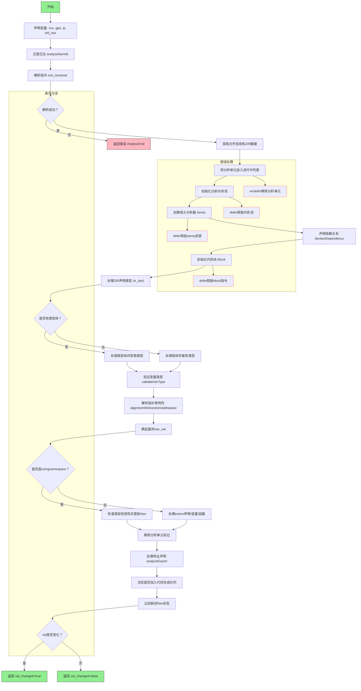

嗯，我需要为这个Zig函数`analyzeNavVal`画一个流程图。首先，我得理解这个函数的结构和逻辑流程。这个函数看起来是用来分析导航值（nav_val）的，可能是在编译器中进行某种类型或值的分析。

首先，函数开始部分声明了一些变量，比如`zcu`、`gpa`、`ip`，然后获取旧的导航信息`old_nav`。接着，它解析了指令`inst_resolved`，并获取对应的文件和ZIR数据。这里可能需要记录分析过程，并处理可能的错误。

然后，创建了一个`Sema`结构体，用于语义分析，这可能涉及到声明依赖关系、处理块（block）以及解析类型和值。函数中多次调用`sema`的方法，比如`declareDependency`、`resolveInlineBody`、`coerce`等，这些都是处理语义分析的不同步骤。

接下来，根据`zir_decl`的不同类型（如`const`、`var`、`usingnamespace`等），进行不同的处理，比如验证变量类型、处理外部声明等。然后处理指针修饰符（alignment、linksection、addrspace），最后确定最终的`nav_val`。

在流程的后半部分，处理`usingnamespace`的情况，检查类型是否符合预期，并更新导航值。之后，处理链接器工作和代码生成队列，根据不同的条件决定是否生成代码。最后，根据旧导航值的状态返回`val_changed`的结果。

在画流程图时，需要将这些步骤分解成不同的节点，并用箭头连接起来，表示执行顺序。同时，注意条件判断（如`switch`语句、`if`条件）会导致分支，需要相应的判断节点。错误处理部分（如`errdefer`）也需要在流程中体现，可能作为异常流程的分支。

可能遇到的挑战是理解每个步骤的具体作用，以及它们之间的依赖关系。有些步骤可能涉及编译器内部机制，比如`ip.resolveNavValue`或`zcu.comp.queueJob`，需要根据函数名和上下文推测其功能。此外，处理条件分支和循环结构时，需要准确反映在流程图中。

最终，流程图应该清晰地展示函数从开始到结束的主要步骤，包括错误处理、条件分支和循环（如果有的话），以及各个子过程之间的调用关系。
================================================
