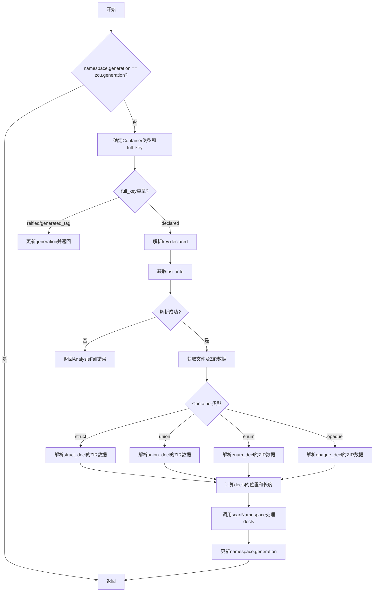

嗯，我现在需要为这个Zig函数画一个流程图。首先，我得仔细读一下代码，理解它的逻辑结构。这个函数叫做ensureNamespaceUpToDate，看起来是确保某个命名空间是最新的。让我先看看函数的大致流程。

函数一开始检查namespace的generation是否等于zcu的generation，如果是就直接返回。这说明如果已经是最新版本，就不需要做任何事情了。如果不是，就需要处理。

接下来，定义了一个Container枚举，然后根据namespace.owner_type的不同类型，决定container的类型和full_key的值。这里用了switch语句，处理struct、union、enum、opaque四种情况，其他情况会触发unreachable，因为命名空间必须由这些容器类型拥有。

然后处理full_key，如果是reified或generated_tag，就直接更新generation并返回。否则，取出declared的d作为key。接下来，获取inst_info，可能需要解析zir索引，如果失败返回错误。然后获取对应的文件和zir数据。

接下来是四个大块的switch，分别处理struct、union、enum、opaque的情况。每个情况里都有一些断言，确保opcode正确，然后从zir的extra数据中提取信息，计算decls的位置和长度。这部分代码看起来是在解析ZIR指令，提取声明部分的数据。

最后，调用pt.scanNamespace处理这些decls，并更新namespace的generation。

现在，我需要把这些步骤转化为流程图。首先，开始节点是函数入口。然后检查namespace.generation是否等于zcu.generation，是的话直接结束。否则继续。

接下来确定container类型和full_key。然后检查full_key的类型，如果是reified或generated_tag，就更新generation并返回。否则继续处理key.declared。

然后解析inst_info，如果失败返回错误。接着根据container类型的不同，进入不同的处理分支。每个分支里都有一些步骤，比如解析extra数据，计算extra_index，获取decls。最后，调用scanNamespace，并更新generation。

需要注意的是，每个container分支中的处理步骤可能不同，但流程图中可能需要将它们合并，或者分别画出不同的分支。可能需要用条件判断节点来表示不同的container类型。

另外，错误处理部分，比如返回error.AnalysisFail，也需要在流程图中体现。

可能的结构是：

开始 -> 检查generation是否最新？是的话结束。
否则，确定container和full_key。
检查full_key是否是reified/generated_tag？是的话更新generation并结束。
否则，获取key.declared。
解析inst_info，失败则返回错误。
根据container类型进入不同的处理路径。
每个处理路径中解析对应的ZIR指令，计算decls。
最后调用scanNamespace，更新generation，结束。

流程图中的每个条件判断需要分支，处理不同的情况。例如，处理struct、union、enum、opaque的不同情况可能需要不同的子流程，但可能可以简化为一个共同的步骤，因为它们的结构类似，只是具体操作不同。

可能需要将每个container分支合并为一个步骤，比如“解析对应类型的decls”，然后统一处理后续步骤。或者，如果每个分支的处理步骤差异较大，可能需要分开画出。

总之，流程图需要反映主要的条件分支和处理步骤，尽量简洁明了。
================================================
