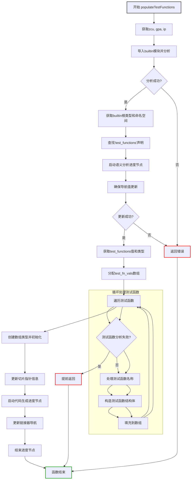

好的，我需要帮用户用Mermaid画出一个Zig函数的流程图。首先，我需要仔细阅读并理解提供的Zig代码。这个函数叫做populateTestFunctions，属于Zcu.PerThread模块。看起来它的主要功能是填充测试函数的相关信息，可能是在编译或静态分析过程中收集测试函数的数据。

首先，我会尝试分解函数的各个步骤，确定主要的流程节点。函数开始于获取一些上下文信息，比如zcu、gpa、ip等。然后导入内置模块（builtin_mod）并确保文件分析完成。接着处理内置模块的根类型和命名空间，查找名为"test_functions"的公共声明。

接下来，函数进入一个代码块，调用ensureNavValUpToDate来确保导航值是最新的。这部分可能涉及语义分析，因此会有进度节点的开始和结束。

之后，函数处理test_functions的值和类型，构造测试函数的相关数据结构，比如数组和指针类型。这里涉及到分配内存、填充测试函数信息，并将它们组织成适当的结构。特别是处理每个测试函数的名称和函数指针，并将这些信息聚合到数组中。

最后，更新指针类型和切片信息，并进行代码生成的步骤，包括链接器的更新。

在绘制流程图时，需要将这些步骤转化为不同的节点，并用箭头表示执行顺序。可能的分支包括错误处理（如OutOfMemory或AnalysisFail），但根据代码中的catch和switch语句，错误处理可能会导致提前返回。

需要注意的是，代码中有几个嵌套的代码块，尤其是那些使用{}包裹的部分，比如处理semantic analysis和code generation的进度节点。这些块需要作为子流程或单独的节点来表示。

可能遇到的挑战是正确捕捉所有条件分支和循环结构。例如，for循环遍历test_fn_vals和zcu.test_functions.keys()，这在流程图中应该表示为循环节点。另外，错误处理路径需要明确标出，比如当遇到AnalysisFail或OutOfMemory时，流程如何分支。

另外，代码中使用了多个Zig特有的结构，如InternPool、Type.fromInterned等，这些可能需要简化为更通用的描述，以便流程图更易理解。

总结步骤：
1. 初始化并获取必要的数据结构（zcu, gpa, ip等）。
2. 导入并分析内置模块。
3. 获取内置模块的命名空间和公共声明。
4. 开始语义分析，确保导航值更新。
5. 处理测试函数的值和类型。
6. 为每个测试函数分配内存并填充数据。
7. 创建数组结构并初始化。
8. 更新指针和切片信息。
9. 进行代码生成步骤，更新链接器。
10. 结束各个进度节点。

在流程图中，每个主要步骤作为一个节点，错误处理和循环结构需要适当表示。可能需要使用子图来处理循环遍历测试函数的部分。
================================================
