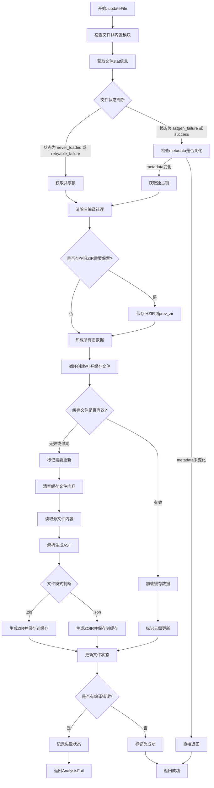

嗯，我需要为这个Zig函数`updateFile`画一个流程图。首先，我应该仔细阅读代码，理解它的逻辑结构和各个步骤。这个函数的主要功能似乎是更新文件，检查缓存，生成AST和ZIR/ZOIR，处理错误，等等。

首先，函数开始时会检查文件是否是内置模块，如果不是，则继续。接着，它会打开文件并获取文件的状态信息（stat）。根据文件的当前状态（如是否已加载过、是否有失败记录等），决定是否需要重新加载或使用缓存。

然后，函数会尝试获取锁，可能是为了多进程或线程之间的同步。接着，它会检查缓存是否存在且有效。如果缓存有效，就直接使用缓存的数据；否则，需要重新解析文件，生成新的AST和ZIR/ZOIR，并保存到缓存中。

在生成新的AST和ZIR/ZOIR的过程中，可能会有错误处理，比如内存分配失败或文件读取错误。最后，根据生成的结果更新文件的状态，记录成功或失败。

我需要把这些步骤分解成流程图中的各个节点，包括条件判断（如检查缓存是否有效、是否需要更新）、循环（如重试获取锁）、错误处理等。同时，注意函数的返回路径和不同状态之间的转换。

可能需要注意的细节包括：

1. 不同文件状态（never_loaded, retryable_failure, astgen_failure, success）的处理路径。
2. 锁的类型（shared或exclusive）的切换。
3. 缓存文件的创建和校验过程。
4. AST和ZIR/ZOIR生成的逻辑分支（根据文件模式是.zig还是.zon）。
5. 错误处理和状态更新。

可能遇到的困难是如何准确地将条件判断和循环转换为流程图的节点，特别是处理锁和缓存的部分。此外，需要确保所有可能的执行路径都被覆盖，比如错误返回、缓存失效后的处理等。

现在，我应该按照步骤来组织流程图，从函数入口开始，逐步画出每个主要操作和判断，直到函数结束。
================================================
