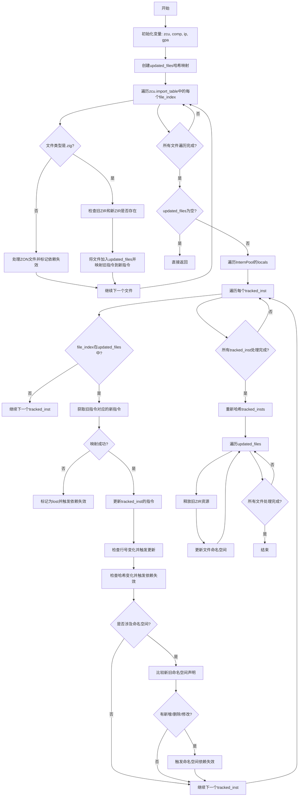

嗯，用户让我用Mermaid画出一个Zig函数的流程图。首先，我需要理解这个函数的功能和结构。这个函数叫做updateZirRefs，属于Zcu.PerThread模块。看起来它的主要作用是更新ZIR（Zig Intermediate Representation）的引用，处理文件变更，跟踪指令的变化，以及处理依赖关系。

首先，我要通读代码，理清逻辑。函数开始检查pt.tid是否为.main，然后初始化一些变量，比如zcu、comp、ip、gpa。接着，它创建了一个updated_files的哈希映射，用来存储更新后的文件信息。之后，遍历zcu.import_table中的每个文件索引，处理每个Zig文件，跳过ZON文件。对于每个Zig文件，如果它的ZIR发生了变化（旧ZIR和新ZIR存在），就将其添加到updated_files中，并映射旧ZIR指令到新ZIR指令。

然后，如果updated_files为空，函数直接返回。否则，进入循环处理每个InternPool中的本地实例。对于每个跟踪的指令，检查它所属的文件是否在updated_files中。如果找不到对应的更新文件，或者旧指令无法映射到新指令，就标记为丢失并触发依赖失效。如果能找到新指令，则更新跟踪的指令，并检查相关属性是否有变化（如行号、哈希值等），如果有变化，则触发相应的依赖失效操作。

接下来，处理命名空间相关的变更，比如结构体、联合体等声明。比较新旧ZIR中的声明，检查是否有新增、删除或修改的公共属性，如果有变化，同样触发依赖失效。

之后，重新哈希跟踪的指令，并处理每个更新过的文件，释放旧的ZIR资源，并更新文件的命名空间。

现在，我需要将这些步骤转化为流程图。流程图通常包括开始、结束、判断、循环、处理步骤等元素。根据代码的结构，大致可以分为以下几个部分：

1. 函数入口和初始化
2. 遍历import_table，处理每个文件
3. 处理ZON文件和Zig文件的旧ZIR到新ZIR的映射
4. 检查updated_files是否为空，决定是否继续
5. 遍历InternPool中的本地实例，处理每个跟踪的指令
6. 处理指令映射失败的情况
7. 检查行号和哈希变化，触发依赖失效
8. 处理命名空间变更
9. 重新哈希跟踪指令
10. 处理更新后的文件，释放资源并更新命名空间
11. 函数结束

需要注意的是循环结构和条件判断的分支。比如，在遍历import_table时，对于每个文件，需要判断是Zig还是ZON文件，处理不同的逻辑。在处理每个跟踪的指令时，可能有多个条件分支，比如映射失败、哈希变化、命名空间变更等。

在绘制流程图时，使用Mermaid的语法，用不同的节点表示步骤，菱形表示判断，箭头表示流程方向。需要确保每个判断的分支都正确，循环结构清晰。此外，可能有些步骤需要分解成更细的节点，比如处理命名空间变更的部分，包括比较新旧声明、处理新增或删除的名称等。

可能遇到的挑战是如何将复杂的逻辑简化，同时保持流程图的准确性和可读性。需要合理组织节点，避免过于拥挤，同时确保所有重要步骤都被涵盖。

总结来说，流程图的结构大致如下：

- 开始
  - 初始化变量
  - 创建updated_files
  - 遍历每个文件索引
    - 判断文件类型（Zig/ZON）
    - 处理ZON文件的逻辑
    - 处理Zig文件的旧ZIR到新ZIR映射
  - 判断updated_files是否为空
  - 遍历InternPool中的本地实例
    - 处理每个跟踪的指令
      - 检查文件是否在updated_files中
      - 映射旧指令到新指令
      - 处理映射失败的情况
      - 检查行号和哈希变化
      - 处理命名空间变更
  - 重新哈希跟踪指令
  - 处理更新后的文件，释放资源，更新命名空间
- 结束

在Mermaid中，用子图来组织循环和条件分支可能有助于提高可读性。例如，将遍历文件和处理每个文件的部分放在一个循环子图中，处理跟踪指令的部分放在另一个循环子图中。每个条件判断用菱形节点，根据结果分支到不同的处理步骤。

需要确保每个步骤之间的连接正确，特别是循环和条件判断后的流程。例如，在遍历import_table时，每个文件处理完成后回到循环的下一个迭代，直到所有文件处理完毕。同样，在处理每个跟踪指令时，处理完一个指令后继续下一个，直到所有处理完成。

最后，检查所有可能的路径是否正确连接，没有遗漏的分支，流程图能够准确反映代码的执行流程。
================================================
