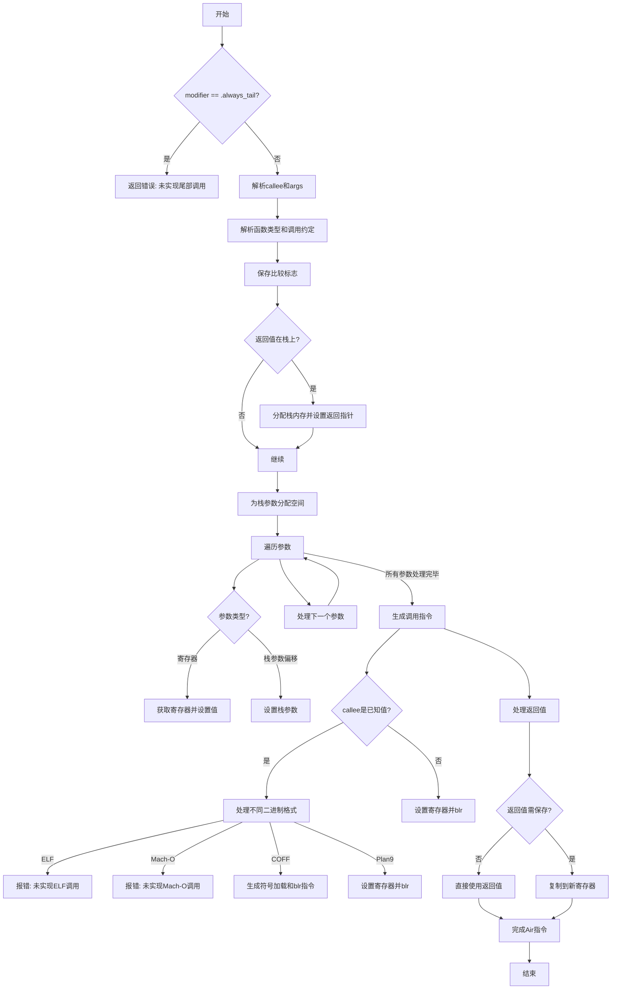

好的，我需要为提供的Zig代码中的`airCall`函数绘制流程图。首先，我会通读代码，理解其结构和逻辑。

函数开始于检查`modifier`是否为`.always_tail`，如果是，则返回错误。接着，获取`callee`和`args`，解析函数类型，处理调用约定，保存比较标志，处理返回值的内存分配，处理参数传递，生成调用指令，处理返回值，最后完成Air指令。

接下来，我需要将每个主要步骤转换为流程图的节点。注意条件判断和循环结构，如`for`循环遍历参数。此外，异常处理和不同的二进制文件格式（如ELF、Mach-O、COFF等）的分支也需要考虑。

可能的结构：
1. 开始
2. 检查`modifier`是否为`.always_tail`，是则报错。
3. 解析`callee`和`args`。
4. 解析函数类型，确定调用约定。
5. 保存比较标志。
6. 处理返回值的内存分配（如果需要）。
7. 为栈参数分配空间。
8. 遍历参数，处理每个参数的传递方式（寄存器或栈）。
9. 根据链接方式生成调用指令（处理不同二进制格式的分支）。
10. 处理返回值，可能需要复制到新寄存器。
11. 完成Air指令，处理结果。

需要确保所有条件分支都被覆盖，如不同的二进制文件处理，以及参数传递的不同情况。此外，错误处理和资源释放（如`info.deinit`）也需适当表示。

最后，使用Mermaid语法将这些步骤组织成流程图，注意节点之间的连接和条件判断的分支。
================================================

该流程图展示了：
1. 入口条件检查尾部调用
2. 参数解析和调用约定处理
3. 栈空间分配和参数传递
4. 根据不同二进制格式生成调用指令
5. 返回值处理和最终指令生成
6. 异常情况处理路径（红色路径表示未实现功能）
7. 主流程和分支条件的完整路径覆盖