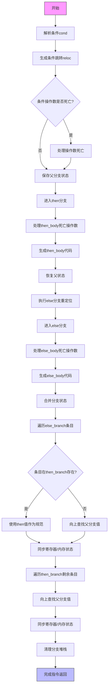

好的，我需要为提供的Zig函数`airCondBr`绘制流程图。首先，我需要仔细阅读并理解这个函数的逻辑。

函数`airCondBr`处理条件分支，首先解析条件操作数，然后处理两个分支（then_body和else_body）。流程大致如下：

1. **解析条件**：通过`resolveInst`获取条件值。
2. **条件分支处理**：调用`condBr`生成条件跳转，并记录重定位信息。
3. **处理操作数死亡**：如果条件操作数在此指令后不再使用，处理其死亡。
4. **保存父分支状态**：保存当前的堆栈和寄存器状态，以便后续恢复。
5. **生成then分支**：处理then_body，生成相应的代码。
6. **恢复父状态**：恢复保存的父分支状态，准备处理else分支。
7. **生成else分支**：处理else_body，生成代码。
8. **合并分支结果**：确保两个分支后的寄存器/堆栈状态一致，处理可能的冲突。
9. **完成指令**：清理并返回。

接下来，我需要将这些步骤转化为流程图。注意函数中的分支堆栈管理、状态保存与恢复，以及合并两个分支后的状态是关键部分。同时，错误处理（如`errdefer`）也需要考虑。

可能的流程节点包括：

- 开始
- 解析条件
- 生成条件跳转
- 处理操作数死亡
- 保存父状态
- 进入then分支
- 生成then_body代码
- 恢复父状态
- 进入else分支
- 生成else_body代码
- 合并分支状态
- 清理分支堆栈
- 完成指令返回

需要注意循环处理死亡操作数和合并分支时的条目迭代。此外，错误处理步骤可能需要在适当的位置加入。

现在，根据这些步骤，使用Mermaid语法构建流程图。确保节点之间的逻辑顺序正确，特别是状态保存与恢复的时机，以及分支处理后的合并过程。
================================================
