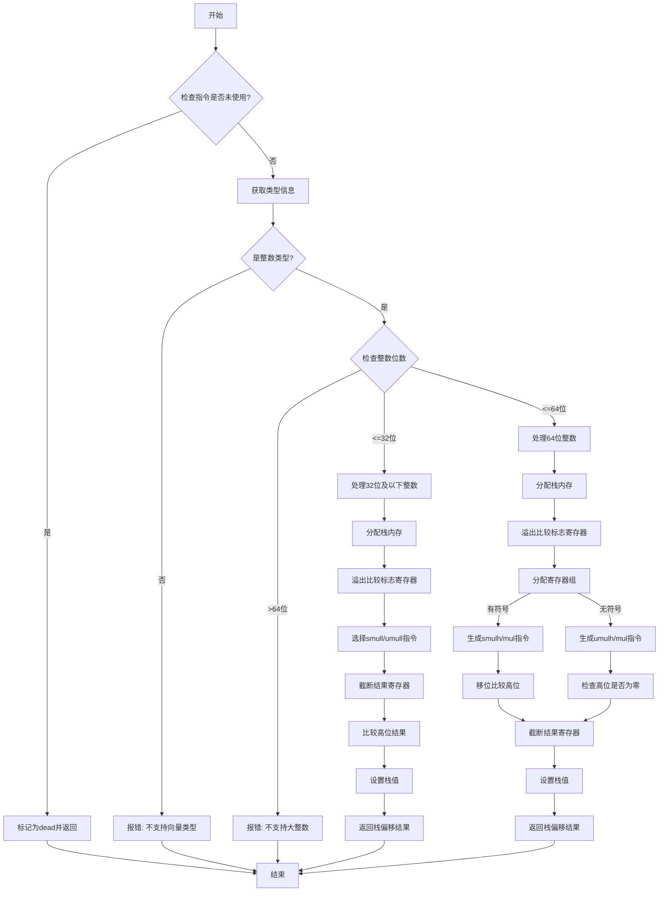

嗯，我需要为这个Zig函数画一个流程图。首先，我得仔细读一遍代码，理解它的结构。这个函数叫airMulWithOverflow，处理乘法溢出。看起来分为几个主要部分，根据整数类型的不同（比如32位、64位以上）有不同的处理逻辑。

首先，函数开始获取指令的数据类型和操作数。然后检查指令是否未被使用，如果是的话就标记为dead。接着根据操作数的类型进行处理，可能是向量或整数。这里主要处理整数类型，分为小于等于32位、小于等于64位和更大的情况。

对于32位及以下的整数，使用smull或umull指令进行乘法，然后截断结果，比较是否有溢出，并将结果存储到栈上。对于64位的情况，处理更复杂，涉及到高位和低位的乘法结果比较，同样需要截断和比较溢出。

我需要把每个条件判断和对应的处理步骤用流程图表示出来。可能需要使用不同的分支，比如判断int_info.bits的大小，选择不同的处理路径。还要注意各个步骤之间的顺序，比如分配寄存器、生成指令、设置栈空间等。

可能的结构是：开始→检查是否未使用→处理整数类型→根据位数分不同情况→生成对应的汇编指令→处理溢出→存储结果→结束。每个判断节点用菱形表示，处理步骤用矩形，箭头连接流程。

可能需要分几个大的分支，比如32位及以下，64位及以下，超过64位报错。每个分支内部又有详细步骤，比如分配内存、生成乘法指令、截断、比较、设置栈值等。

另外，还要注意错误处理，比如遇到向量类型或大整数时返回错误。这些也应该在流程图中体现为终止节点或者错误处理路径。

总之，流程图应该清晰地展示函数的不同执行路径，包括条件判断、循环（如果有的话）、各个处理步骤以及最终的返回结果。
================================================
