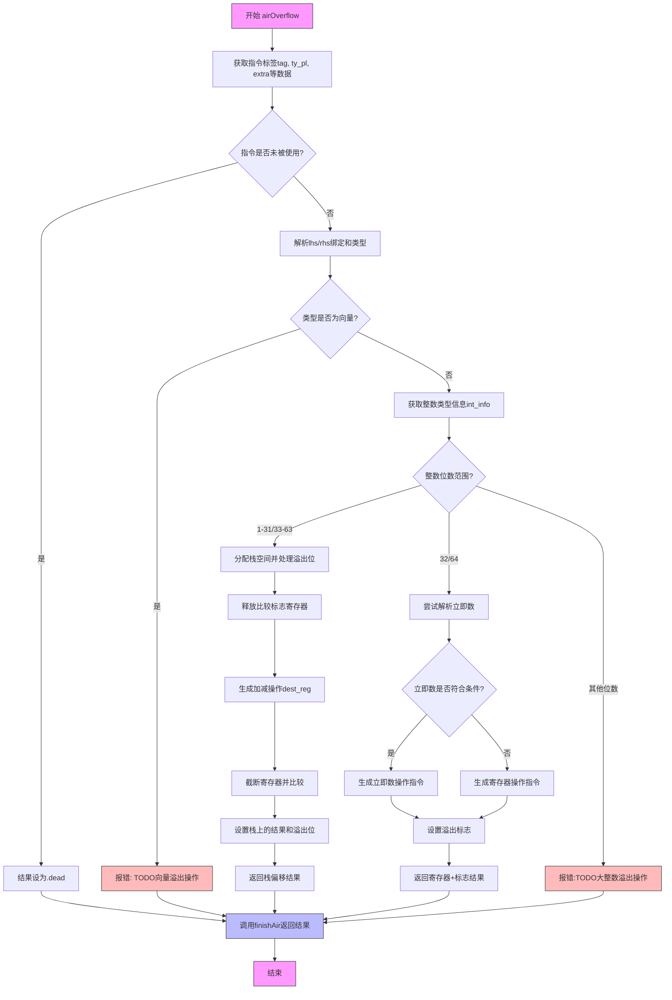

好的，我需要为提供的Zig代码函数`airOverflow`绘制一个流程图。首先，我需要理解这个函数的结构和逻辑。

首先，函数开始获取指令的标签`tag`、类型和有效载荷`ty_pl`，以及额外的数据`extra`。接着，它定义了一些变量如`pt`、`zcu`，然后根据指令是否未被使用来决定结果是否为`.dead`。

接下来，函数处理两种情况：向量类型和整数类型。对于整数类型，根据位数（1-31、33-63，32、64）有不同的处理逻辑。例如，对于1-31和33-63位，会分配栈空间，处理溢出位，生成机器码指令。对于32和64位，处理立即数的情况，并生成相应的指令。

我需要将每个条件判断和分支转化为流程图的节点和分支。例如，`switch (lhs_ty.zigTypeTag(zcu))`会分出向量和整数两个分支。在整数分支中，根据位数再次分支，处理不同的情况。

需要注意错误处理，如`return self.fail(...)`和`unreachable`，这些可能需要作为终止节点。此外，函数末尾的`return self.finishAir(...)`也是流程的结束点。

在绘制时，使用矩形框表示处理步骤，菱形框表示条件判断，箭头表示流程方向。确保每个条件分支都有明确的出口，如处理不同位数的情况，以及立即数是否可用的判断。

最后，检查流程是否覆盖了所有代码路径，包括错误路径和正常结束路径。确保逻辑正确，没有遗漏任何分支。
================================================
