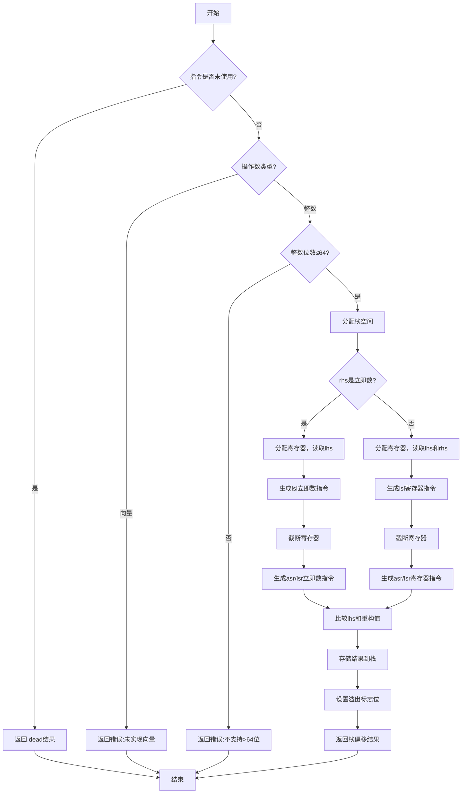

好的，我需要为提供的 Zig 函数 `airShlWithOverflow` 绘制一个流程图。首先，我会通读代码，理解它的结构和逻辑流程。

函数的主要功能是处理带有溢出检查的左移操作（`shl_with_overflow`）。从代码中可以看到，函数首先处理类型和参数，然后根据操作数的类型（整数或向量）分情况处理。由于向量部分还未实现，直接返回错误。对于整数类型，进一步根据位数是否小于等于64位进行处理。如果超过64位，则返回未实现的错误。

接下来，处理立即数（立即数是指直接在指令中编码的常数）和寄存器操作数两种情况。对于立即数的情况，分配寄存器，执行左移指令，然后进行截断处理。接着，根据符号性执行算术右移或逻辑右移，生成重构后的值。比较原始左操作数和重构后的值，以确定是否溢出。

对于寄存器操作数的情况，流程类似，但使用寄存器间的移位操作。之后，将结果存储到栈上，并设置溢出标志位。

最后，返回结果。

在绘制流程图时，需要将这些步骤分解为决策点和操作步骤。主要分支包括：

1. 判断是否未使用指令，直接返回。
2. 判断操作数类型是否为向量，返回错误。
3. 整数类型的处理，进一步判断位数是否超过64位。
4. 立即数或寄存器操作数的处理。
5. 执行相应的移位操作和比较。
6. 存储结果和溢出标志到栈。
7. 返回结果。

需要注意条件判断的分支，例如 `if (self.liveness.isUnused(inst))`、`switch (lhs_ty.zigTypeTag(zcu))` 中的 `.vector` 和 `.int`，以及内部的 `if (rhs_immediate)` 等。

可能遗漏的步骤包括错误处理、寄存器分配、截断操作等细节，这些都需要在流程图中体现出来。

现在，根据以上分析，使用 Mermaid 语法绘制流程图。流程图中的各个节点应表示操作步骤，条件判断使用菱形节点，箭头表示流程方向。
================================================
