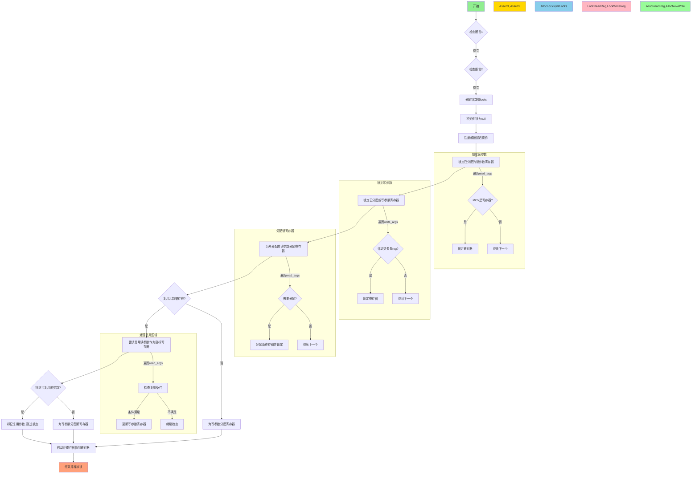

嗯，我需要为这个Zig函数`allocRegs`画一个流程图。首先，我得仔细阅读代码，理解它的结构和逻辑。函数的主要功能是分配寄存器，处理读写参数，以及可能的复用元数据。看起来函数分为几个部分：参数验证、锁定寄存器、分配寄存器、处理复用元数据、以及最后的移动非寄存器值到寄存器。

首先，函数开始有两个断言，检查`reuse_metadata`是否存在时，`write_args`的长度是否为1，以及`operand_mapping`的长度是否等于`read_args`的长度。这应该是预处理的条件检查，确保输入参数的有效性。接下来，分配了一个锁数组`locks`，用于跟踪已锁定的寄存器，然后初始化这些锁为null，并在最后释放锁。

然后，函数锁定已经分配到寄存器的读参数和写参数。对于读参数，如果其绑定解析为寄存器，则锁定该寄存器；写参数如果绑定到寄存器，同样进行锁定。接下来，为尚未分配寄存器的参数分配寄存器，这里分为读参数和写参数处理。读参数中，如果绑定不是寄存器，则分配新寄存器并锁定；写参数类似，但如果有复用元数据，则会尝试复用读参数的寄存器，否则分配新寄存器。

在处理复用元数据时，函数会检查是否可以复用某个读参数作为目标寄存器，如果可以，则标记该读参数为已复用，避免后续重复处理。之后，对于需要从非寄存器移动到寄存器的读参数，生成相应的指令来设置寄存器。

现在，我需要将这些步骤转化为流程图。流程图的开始应该是函数入口，然后是各个条件判断和操作步骤。需要注意条件分支，如`reuse_metadata`是否存在，以及循环处理每个读/写参数。同时，错误处理和资源释放（如解锁寄存器）也需要在流程图中体现。

可能的结构是：

1. 开始
2. 检查断言
3. 分配和初始化锁数组
4. 锁定已分配的读参数寄存器
5. 锁定已分配的写参数寄存器
6. 分配未分配的读参数寄存器
7. 处理复用元数据（如果存在）
   a. 尝试复用读参数寄存器
   b. 成功则标记复用，否则分配新寄存器
8. 分配未分配的写参数寄存器（若无复用）
9. 移动非寄存器值到寄存器（处理读参数）
10. 结束，释放锁

需要特别注意循环结构，比如遍历`read_args`和`write_args`的每个元素，以及条件判断如`reuse_metadata`是否存在，`arg.bind`的类型等。可能使用子流程或循环节点来表示这些重复操作。

另外，错误处理部分（如`try`和`InnerError`）可能在流程图中以错误出口表示，但原函数中主要是通过返回错误来处理，可能不需要特别标注，除非有显式的错误分支。

最后，确保流程图的连贯性和逻辑正确性，每个步骤之间的转换清晰，条件分支明确。
================================================

该流程图关键点说明：
1. 使用黄色高亮显示前置条件断言
2. 用蓝色表示内存分配和初始化操作
3. 粉红色表示寄存器锁定操作
4. 绿色表示寄存器分配操作
5. 复用逻辑采用独立子流程，包含条件检查循环
6. 最终的非寄存器值移动操作集中处理
7. 所有操作最终汇集到释放锁的结束节点
8. 通过子流程清晰展示多级循环结构
9. 使用条件分支处理复用元数据的不同情况
10. 保持函数的核心逻辑路径从左到右的自然流向