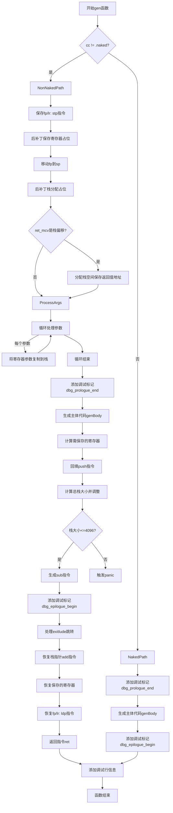

嗯，我需要用Mermaid来画这个函数的流程图。首先，我得仔细阅读并理解这个函数的结构。这个函数是gen，属于aarch64的代码生成部分。函数的主要逻辑是根据调用约定（是否naked）来处理不同的情况。

首先，函数开始时检查调用约定是否为naked。如果不是naked，就执行一系列的指令，比如保存寄存器、处理参数、生成函数体，然后在退出时恢复寄存器和栈指针。如果是naked，则直接生成函数体，不需要处理栈和寄存器。

我需要将每个条件分支和循环结构转化为流程图中的节点和判断框。例如，函数开始时判断cc != .naked，如果是的话进入一个大的处理块，否则处理naked的情况。在处理非naked的情况下，有多个步骤：保存寄存器对（stp），分配栈空间，处理返回值，处理参数，生成主体代码，最后恢复寄存器和返回。

需要特别注意循环结构，比如处理每个参数的循环（for (self.args, 0..)），这里可能需要一个循环节点。另外，存在多个条件判断，比如检查是否可以将栈大小转换为u12，或者是否需要调整栈对齐。

同时，注意到有一些后补丁（backpatch）操作，比如backpatch_save_registers和backpatch_reloc，这些可能在流程图中表示为特殊的步骤，可能需要标注出来。

在生成流程图时，可能需要将每个主要操作步骤作为节点，条件判断作为菱形框，循环结构用循环节点表示。此外，异常处理和错误路径也需要考虑，但由于函数返回的是!void，可能错误处理在流程图中以单独的分支表示。

总结下来，流程图的大致结构是：

1. 开始
2. 判断cc是否不是naked
   - 是：处理非naked路径
     a. 保存fp和lr到栈
     b. 后补丁保存寄存器
     c. 移动fp到sp
     d. 后补丁分配栈空间
     e. 处理返回值到栈
     f. 循环处理每个参数到栈
     g. 生成主体代码
     h. 后补丁保存的寄存器列表
     i. 调整栈大小
     j. 处理退出跳转
     k. 恢复栈指针
     l. 恢复寄存器
     m. 加载fp和lr，返回
   - 否：处理naked路径
     a. 生成主体代码
3. 添加调试信息行
4. 结束

需要注意各个步骤之间的顺序和条件分支，确保流程图正确反映代码的执行流程。
================================================
