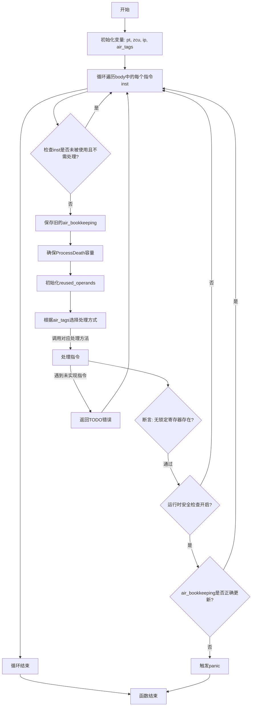

嗯，我需要为这个Zig函数genBody画一个流程图。首先，我得理解这个函数的结构。函数遍历body里的每个指令，根据不同的指令类型调用不同的处理方法。每个指令处理前会做一些检查，比如判断是否未被使用，是否需要跳过。处理完每个指令后还有一些断言和错误检查。

首先，函数开始的时候，获取一些变量，比如pt、zcu、ip和air_tags。然后进入一个循环，遍历body里的每个inst。在循环内部，首先检查inst是否未被使用且不需要强制处理，如果是的话就跳过。接下来保存旧的air_bookkeeping，确保有足够的容量来处理死亡指令，然后初始化reused_operands。

然后是一个大的switch语句，根据不同的air_tags调用不同的方法，比如airBinOp、airPtrArithmetic等等。有些情况会直接返回错误，比如TODO的那些未实现功能。处理完指令后，有一个断言检查是否存在锁定的寄存器。

最后，在循环结束后，如果开启了运行时安全检测，会检查air_bookkeeping是否正确增加，否则触发panic。

接下来，我需要将这些步骤转化为流程图。流程图应该从函数入口开始，然后循环处理每个指令，每个指令的处理流程包括条件判断、方法调用、错误处理等。需要注意的是，switch语句中的每个分支可能有不同的处理路径，但为了简化流程图，可以将switch作为一个整体步骤，然后根据不同情况分支。不过这样可能会导致流程图过于复杂，可能需要概括处理。

可能的结构是：

1. 函数开始
2. 初始化变量
3. 循环遍历body中的每个inst
   a. 检查是否跳过该inst
   b. 保存旧air_bookkeeping
   c. 确保容量
   d. 初始化reused_operands
   e. switch处理不同指令类型
   f. 断言检查寄存器
   g. 运行时安全检查
4. 结束循环
5. 函数结束

其中，步骤e的switch可以简化为一个判断框，然后指向不同的处理分支，但可能太多分支，无法一一画出。所以可能需要概括为“处理指令”的步骤，然后如果有未实现的指令，触发错误。

此外，错误处理部分需要体现在流程图中，比如返回错误或触发panic。

可能需要用多个节点来表示这些步骤，并用箭头连接起来，包括循环和条件判断的分支。
================================================

流程说明：
1. 函数入口初始化必要变量
2. 进入主循环遍历所有AIR指令
3. 对每个指令先做有效性检查（是否可跳过）
4. 保存旧状态并确保内存容量
5. 根据指令类型进入巨型switch分发处理
6. 每个指令处理完成后验证寄存器状态
7. 在debug模式下检查簿记是否正确
8. 循环处理直至所有指令完成
9. 异常路径处理：未实现功能直接返回错误，簿记错误触发panic