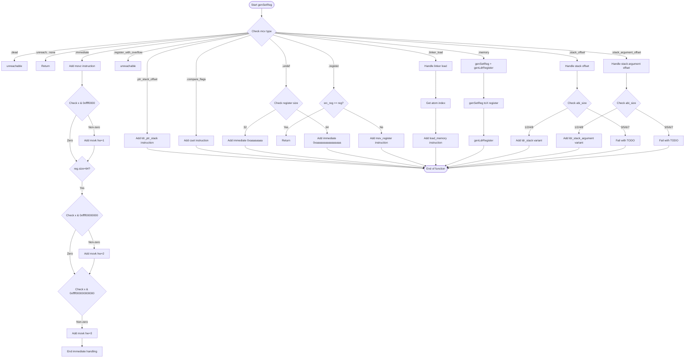

好的，我需要为提供的 Zig 函数 `genSetReg` 绘制流程图。首先，我会仔细阅读代码，理解它的逻辑结构。

函数 `genSetReg` 的主要作用是根据不同的 `MCValue` 类型生成相应的机器指令，将值设置到寄存器中。代码中使用了一个 `switch` 语句来处理不同的 `mcv` 情况。每个分支对应不同的处理逻辑，比如处理立即数、寄存器、内存地址等。

首先，我会列出所有的 `MCValue` 情况：

1. `.dead`：直接触发 `unreachable`。
2. `.unreach`, `.none`：直接返回，无需操作。
3. `.undef`：根据寄存器大小写入特定的立即数。
4. `.ptr_stack_offset`：生成 `ldr_ptr_stack` 指令。
5. `.compare_flags`：生成 `cset` 指令。
6. `.immediate`：使用 `movz` 和可能的 `movk` 指令加载立即数。
7. `.register`：如果源寄存器与目标寄存器不同，生成 `mov_register` 指令。
8. `.register_with_overflow`：触发 `unreachable`。
9. `.linker_load`：根据不同的加载类型生成相应的指令。
10. `.memory`：递归调用 `genSetReg` 和 `genLdrRegister`。
11. `.stack_offset`：根据类型大小生成不同的加载指令。
12. `.stack_argument_offset`：类似 `.stack_offset`，但针对参数栈。

接下来，我需要将这些逻辑转化为流程图。每个 `case` 对应一个决策节点或处理步骤。需要注意递归调用和处理不同寄存器大小的分支。

可能的流程步骤：

- 开始函数。
- 检查 `mcv` 的类型，进入对应的分支。
- 每个分支内部的操作，如生成指令、递归调用等。
- 处理完成后的返回。

需要特别注意条件判断，比如在 `.immediate` 中根据值的不同部分生成多个 `movk` 指令，以及在 `.stack_offset` 中根据 `abi_size` 选择不同的指令标签。

在绘制流程图时，使用菱形表示条件判断，矩形表示操作步骤，箭头表示流程方向。确保覆盖所有分支，包括错误处理和未实现的部分（如 `TODO implement genSetReg`）。

最后，验证流程图的完整性，确保所有可能的路径都被正确表示，没有遗漏任何 `case` 或条件分支。
================================================
