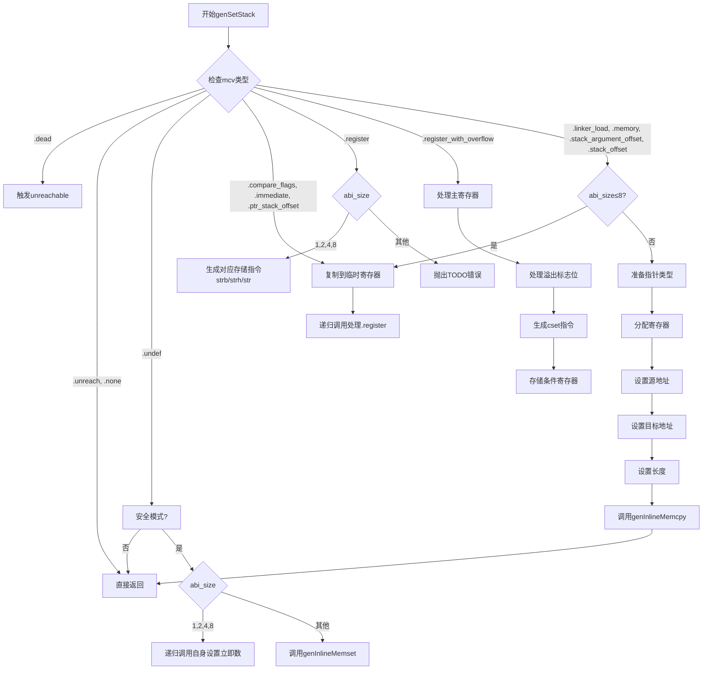

好的，我需要为提供的Zig函数`genSetStack`绘制流程图。首先，我需要理解这个函数的结构和逻辑。

函数的主要功能是根据不同的`MCValue`类型，生成相应的汇编指令来处理栈上的数据存储。函数使用了一个大的switch语句来分支处理不同的情况，比如`.undef`、`.register`、`.register_with_overflow`等。

首先，我会逐一分析每个case的处理逻辑：

1. **.dead**：直接触发unreachable，表示不应该出现这种情况。
2. **.unreach和.none**：直接返回，无需操作。
3. **.undef**：在安全模式下，根据abi_size的不同，设置不同的立即数或调用内联memset。
4. **.compare_flags、.immediate、.ptr_stack_offset**：将这些值复制到临时寄存器，然后递归调用自身处理寄存器的情况。
5. **.register**：根据abi_size选择合适的存储指令（如strb_stack、strh_stack等），生成相应的汇编指令。
6. **.register_with_overflow**：处理带有溢出标志的情况，分别存储寄存器和条件标志到栈的不同位置。
7. **其他情况（如memory、stack_offset等）**：处理较大的abi_size，调用内联memcpy进行内存复制。

接下来，我需要将这些逻辑步骤转化为流程图的节点和分支。每个case对应一个分支，递归调用或函数调用需要表示为子流程。同时，需要注意条件判断，如abi_size的不同值、是否安全模式等。

可能的流程结构如下：

- 开始函数
- 检查MCValue类型
  - 分支到各个case处理
  - 每个case内部可能有条件判断（如abi_size）
  - 处理完毕后返回或继续其他操作

在绘制时，需要确保所有分支都被覆盖，并且递归调用（如处理.undef时调用自身）需要适当表示，避免循环。同时，复杂的子流程（如内联memset或memcpy）可能需要简化为一个步骤，除非特别需要展开。

最后，根据分析结果，使用Mermaid语法绘制流程图，确保结构清晰，逻辑正确。
================================================
