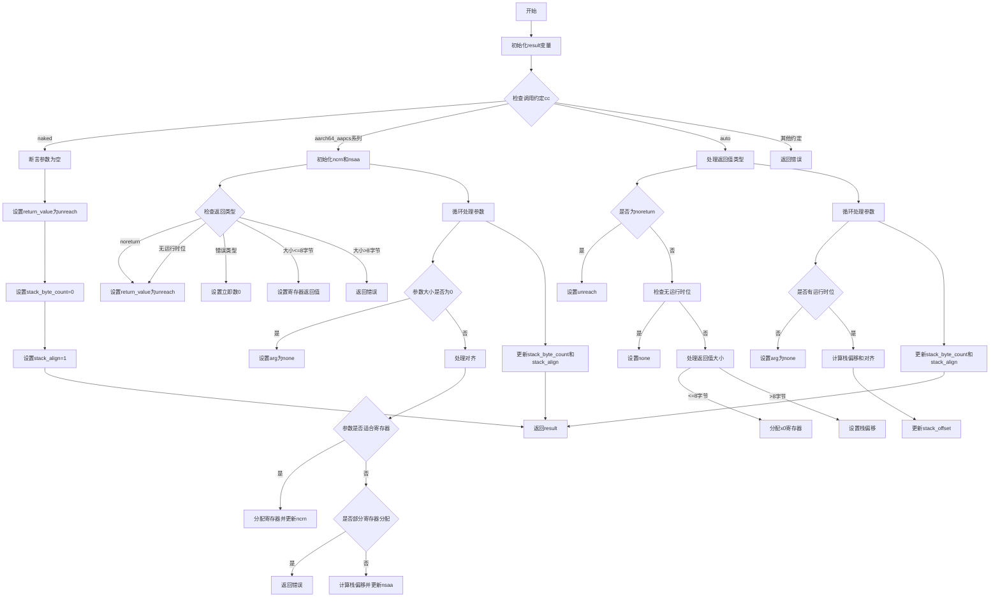

嗯，我需要帮用户用Mermaid画这个Zig函数的流程图。首先，我得理解这个函数的结构。这个函数是resolveCallingConventionValues，属于AArch64的代码生成部分。看起来它的主要任务是根据调用约定处理函数参数和返回值。

首先，函数开始处初始化了result变量，包括args数组、return_value、stack_byte_count和stack_align。然后根据不同的调用约定（cc）处理不同的情况。用户提供的代码中有三个主要分支：.naked、.aarch64_aapcs系列和.auto，还有其他情况返回错误。

我需要把这些逻辑分支转化为流程图。每个case下的处理步骤需要细化。比如，在.naked的情况下，做一些断言，设置返回值为unreach，stack_byte_count为0等。而在.aarch64_aapcs分支里，处理参数寄存器分配和栈空间计算。.auto分支则处理返回值和参数的栈偏移。

需要注意的是错误处理部分，比如errdefer释放内存，还有各种条件判断，比如ret_ty的类型判断，参数大小和对齐的处理。这些条件判断在流程图中需要用菱形判断框表示。

可能的结构是：

开始 -> 初始化result -> 检查cc类型 -> 分三个主要分支：naked、aarch64_aapcs、auto。每个分支内有各自的处理流程，比如参数循环处理，寄存器分配，栈偏移计算等。最后设置stack_byte_count和stack_align，返回结果。

对于每个参数循环，可能需要用循环结构表示。不过Mermaid的流程图对循环支持有限，可能需要用子流程或者注释说明。

此外，对于每个分支中的条件判断，比如ret_ty的类型是否为noreturn，是否有运行时位，参数大小是否超过8字节等，这些都需要在流程图中体现。

可能还需要处理错误情况，比如返回fail的情况，但用户提供的代码中主要是返回错误，而没有其他复杂的错误处理。

现在，我需要把这些步骤转化为Mermaid的语法，确保逻辑正确，结构清晰。需要注意各个步骤的顺序和条件分支的正确连接。
================================================
