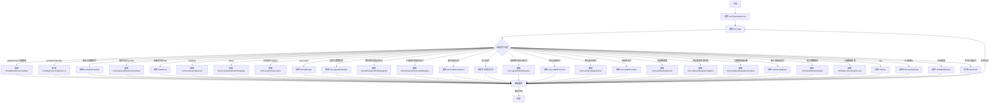

嗯，用户让我用Mermaid画出这个Zig函数的流程图。首先，我需要理解这个函数的结构和逻辑。函数名为emitMir，接受一个Emit类型的指针作为参数，返回一个错误联合类型void。看起来这个函数的作用是根据不同的MIR（可能是指中间表示）指令标签，调用对应的emit方法生成机器码。

首先，函数开始调用了emit.lowerBranches()，这一步可能是处理分支指令的优化，找到最小的lowerings。然后进入一个循环，遍历mir_tags（指令标签数组），对于每个标签和对应的索引，根据不同的标签调用不同的emit方法。

接下来，我需要把这个逻辑转化为流程图。流程图的起点是函数开始，然后执行lowerBranches，接着循环处理每个指令。每个指令会根据其标签进入不同的处理分支，比如add_immediate会调用mirAddSubtractImmediate，而b_cond会调用mirConditionalBranchImmediate等等。

需要注意的是，循环中的每个case对应不同的处理函数，这些处理函数可能有很多，需要确保每个分支都被正确表示。同时，循环结束后，函数结束。

可能的挑战是如何简洁地表示大量的switch case分支，而不让流程图变得过于复杂。或许可以将类似的case分组，比如将多个处理相同emit方法的标签合并为一个节点，例如所有调用mirAddSubtractImmediate的标签可以归为一类。

此外，函数中还有一些特殊的处理，比如dbg_line、dbg_prologue_end等调试相关的指令，也需要在流程图中体现出来。

最后，流程图需要符合Mermaid的语法，正确使用节点、箭头和条件判断的结构。可能需要使用子图来组织不同的处理分支，或者使用注释来保持可读性。

总结步骤：
1. 开始节点：函数开始。
2. 调用lowerBranches方法。
3. 进入循环，遍历每个指令标签。
4. 对于每个标签，根据不同的tag进入不同的处理分支。
5. 每个分支调用对应的emit方法。
6. 循环结束后，结束函数。

需要确保每个case都被覆盖，但为了避免重复，可以将调用相同方法的多个标签合并描述。例如，对于多个标签调用mirAddSubtractImmediate，可以用一个节点表示所有这些标签的处理。
================================================
