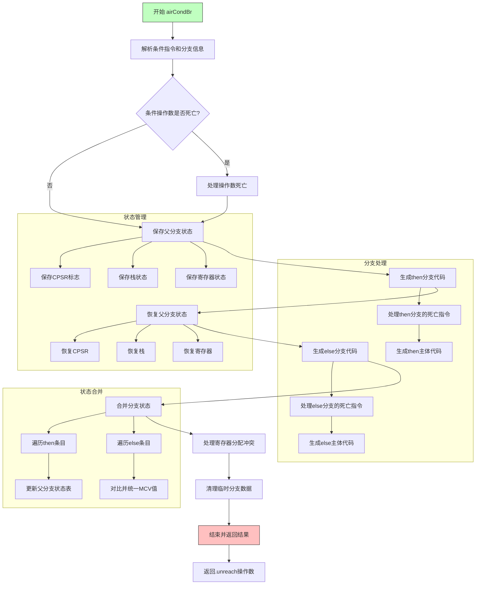

嗯，用户让我用Mermaid画出一个Zig函数的流程图。首先，我需要仔细阅读这个函数，理解它的逻辑结构。这个函数是处理条件分支的，函数名是`airCondBr`，看起来像是编译器后端的一部分，负责生成ARM架构的代码。

首先，我得理清函数的主要步骤。函数开始解析条件指令，处理条件分支的两个分支（then和else）。然后保存当前的状态，比如寄存器和栈的分配情况，接着分别生成两个分支的代码，之后合并两个分支的状态，确保寄存器分配一致，最后处理资源的释放和收尾工作。

接下来，我需要将这个过程分解成流程图中的各个节点。可能需要分为以下几个部分：
1. 解析指令和条件操作数。
2. 处理条件死亡的情况。
3. 保存父分支的状态（寄存器、栈等）。
4. 生成then分支的代码。
5. 恢复父分支状态，生成else分支代码。
6. 合并两个分支的寄存器分配和状态。
7. 清理资源，完成指令。

在绘制流程图时，需要注意条件判断和循环结构，比如处理then和else分支后的状态恢复和合并。另外，函数中有错误处理部分（errdefer），也需要在流程中体现可能的错误路径。

可能遇到的难点是如何正确表示状态的保存和恢复，以及分支合并的逻辑。需要确保每个步骤之间的过渡清晰，特别是分支处理后的状态回退和合并操作。同时，函数中的日志记录和调试信息可能不需要体现在流程图中，但关键的逻辑步骤必须明确。

最后，按照Mermaid的语法结构将这些步骤组织成流程图，使用合适的节点和箭头连接，确保逻辑流程正确无误。可能需要使用子图来区分then和else分支的处理，以及合并过程。
================================================
