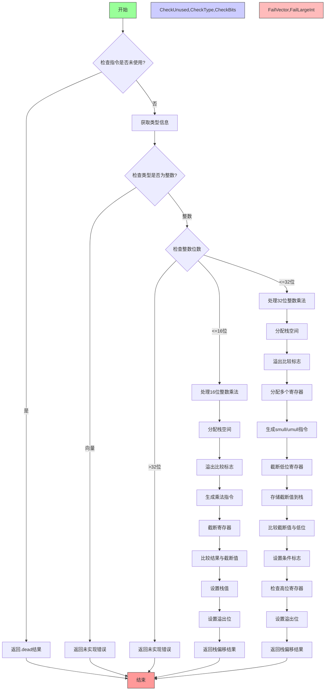

好的，我需要为这个Zig函数`airMulWithOverflow`绘制流程图。首先，我得理解这个函数的结构和逻辑。

函数开始处，获取了一些类型和参数信息，比如`ty_pl`、`extra`，然后检查指令是否未被使用，如果是的话就直接返回。接着定义了`pt`、`zcu`等变量，然后进入`result`的代码块。

接下来，根据`lhs_ty`的类型进行判断，如果是向量类型则返回错误，因为还未实现。如果是整数类型，则进一步处理。这里分成了两种情况：位数小于等于16位和小于等于32位，分别有不同的处理逻辑。对于超过32位的整数，则返回未实现的错误。

在处理16位整数时，函数分配栈空间，处理寄存器，生成乘法指令，然后截断寄存器，比较结果，最后设置栈上的值。而对于32位整数，处理更复杂，包括分配多个寄存器，生成不同的乘法指令（如`smull`或`umull`），然后进行截断、比较，设置条件标志，并将结果存回栈。

我需要将所有这些条件分支和步骤用流程图表示出来。可能需要使用不同的分支节点，如判断类型、位数大小，以及相应的处理步骤。同时要注意循环、条件判断和各个操作之间的流程。

需要确保每个判断节点（如类型是否为向量、整数位数）都有对应的分支，处理步骤按顺序排列，并且最终结果如何返回。另外，错误处理和未实现的部分也要在流程图中体现。

可能的结构是开始节点，然后依次进行各个判断，每个判断后接对应的处理步骤，最后结束于返回结果。需要注意各个条件之间的连接，以及可能的并行处理步骤是否在流程图中正确表示。
================================================
