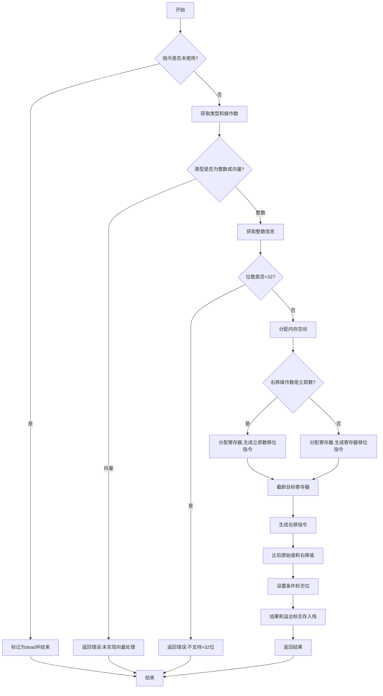

好的，我需要为提供的Zig函数`airShlWithOverflow`绘制流程图。首先，我需要理解这个函数的功能和结构。这个函数处理左移操作并检查溢出，生成相应的机器码。

函数开始部分获取指令的数据类型和操作数，检查指令是否未被使用，如果是，则标记为dead。接着处理不同的类型，比如向量和整数。这里主要处理整数类型，尤其是位数小于等于32的情况。对于更大的整数，暂时不支持，返回错误。

在处理整数时，函数分配内存空间，处理寄存器的分配，生成左移指令，然后进行截断。接着根据符号生成右移指令（算术或逻辑右移），比较原始值和右移后的值，设置条件标志位。最后，将结果和溢出标志存入栈中，并返回结果。

接下来，我需要将这个过程分解成流程图中的各个步骤。流程图的开始是函数入口，然后根据不同的条件分支处理。主要的判断点包括：指令是否未使用、类型是否为向量或整数、整数位数是否超过32位、右移操作数是立即数还是寄存器。

每个条件分支后，执行相应的操作，比如分配寄存器、生成机器指令、设置栈上的结果和溢出标志。最后返回结果。

需要注意的是，流程图需要清晰地展示各个判断点和对应的处理步骤，以及流程的走向。使用Mermaid的语法，用不同的节点表示判断、操作和结束点，用箭头连接它们。

可能存在需要简化的部分，比如具体的寄存器分配细节，但为了保持流程图的可读性，可以适当概括这些步骤。同时，确保错误处理和未实现的部分（如向量和大于32位的整数）也被正确表示。

总结一下，流程图的大致结构如下：

1. 开始
2. 检查指令是否未被使用，如果是，结束并标记为dead
3. 获取类型信息，判断是否为整数或向量
4. 如果是向量，返回未实现错误
5. 如果是整数，检查位数
6. 如果位数超过32位，返回未实现错误
7. 分配内存空间
8. 处理左移操作数是否为立即数
9. 分配寄存器，生成左移和右移指令
10. 比较原始值和右移后的值，设置标志位
11. 将结果和溢出标志存入栈
12. 返回结果

现在需要将这些步骤转化为Mermaid流程图，确保逻辑正确，分支清晰。
================================================
