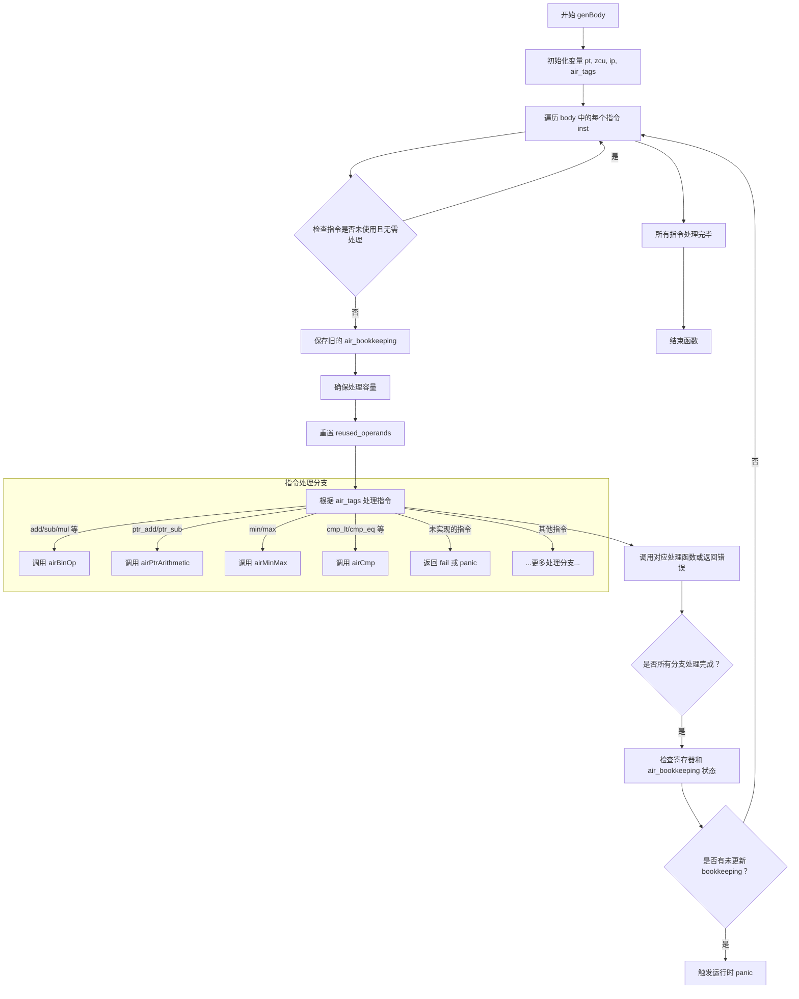

嗯，我需要为提供的Zig函数`genBody`画一个流程图。首先，我得仔细阅读代码，理解它的结构和工作流程。函数的主要作用似乎是处理一系列的AIR指令，每个指令对应不同的处理函数。让我分步骤分析一下：

1. **函数入口**：函数`genBody`接受`self`指针和`body`参数，`body`是一个包含多个`Air.Inst.Index`的切片。
2. **初始化变量**：函数开始时会获取`pt`、`zcu`、`ip`和`air_tags`等变量。
3. **遍历指令**：使用`for`循环遍历`body`中的每个指令`inst`。
4. **跳过未使用的指令**：在循环内部，首先检查指令是否未被使用且不需要强制处理，如果是，则跳过该指令。
5. **准备处理指令**：保存旧的`air_bookkeeping`状态，并确保有足够的容量处理新的指令。
6. **重置重用操作数**：初始化`reused_operands`为一个空集合。
7. **处理不同的指令类型**：通过`switch`语句根据`air_tags`的值跳转到不同的处理函数。这里有很多分支，每个分支对应不同的AIR指令，例如`.add`、`.sub`等，调用对应的函数如`airBinOp`、`airPtrArithmetic`等。
8. **错误处理**：部分分支直接返回错误，如遇到未实现的指令（例如`.repeat`、`.switch_dispatch`）。
9. **后处理检查**：在处理完每个指令后，检查寄存器管理器和`air_bookkeeping`的状态，确保没有遗留锁定的寄存器，并且在调试模式下验证`air_bookkeeping`是否正确更新。
10. **循环结束**：处理完所有指令后，函数结束。

接下来，我需要将这些步骤转化为流程图。流程图的节点应包括循环开始、条件判断、指令处理、错误返回等。需要注意循环内的处理流程，以及不同指令分支的跳转。

可能的遗漏或错误点：
- 是否有未覆盖的`switch`分支？例如，默认分支是否存在？代码中`// zig fmt: off`和`// zig fmt: on`之间的分支似乎都覆盖了，但需要确认是否有默认处理。
- 错误处理部分是否统一？例如，`return self.fail(...)`和`unreachable`的处理方式。
- `air_bookkeeping`的更新是否正确，是否有遗漏的`finishAirBookkeeping`调用？

根据以上分析，可以开始绘制流程图。主要结构是循环遍历每个指令，根据指令类型进行不同处理，并进行状态检查和错误处理。
================================================
