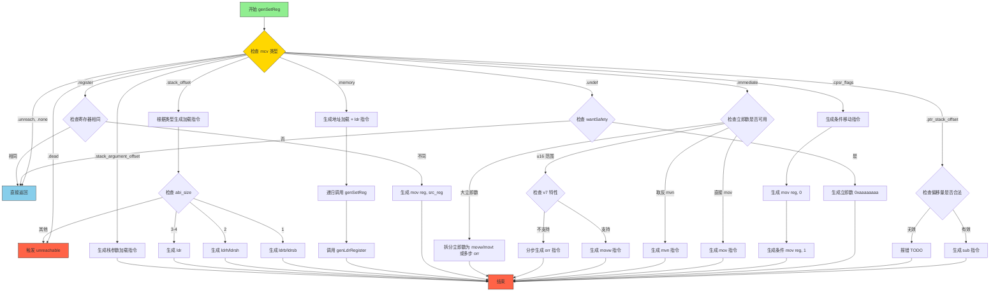

嗯，用户让我用Mermaid画出一个Zig函数的流程图。首先，我需要仔细阅读并理解这个函数的逻辑。函数是genSetReg，看起来是用来根据不同的MCValue类型生成相应的ARM汇编指令。

首先，函数开始处理不同的MCValue情况。每个case对应不同的处理逻辑。比如，当mcv是.dead时，会触发unreachable；如果是.undef，则根据安全设置决定是否写入特定立即数。然后是.ptr_stack_offset、.cpsr_flags、.immediate等等，每个分支都有不同的指令生成逻辑。

接下来，我需要确定如何将每个switch分支转化为流程图的节点和判断。可能需要将每个switch case作为一个判断节点，然后根据不同的条件分支到不同的处理步骤。例如，处理.immediate时，内部还有多个条件判断，比如是否能用mov指令，或者是否需要使用movw和movt组合，或者更复杂的逻辑。

另外，像处理.memory和.stack_offset等case，可能涉及到递归调用genSetReg或者调用其他函数如genLdrRegister，这些也需要在流程图中体现出来。

需要注意的是，流程图的每个节点应该简洁，避免过于复杂。可能需要将一些复杂的条件拆分成多个步骤，确保流程图的可读性。同时，要确保所有可能的执行路径都被覆盖，比如每个switch分支的处理，以及内部的条件判断。

还有，用户提供的代码中有一些TODO注释，比如在.ptr_stack_offset中提到的处理大偏移量的问题，这在流程图中可能需要标注出来，或者作为备注。

最后，确认Mermaid的语法是否正确，比如使用正确的图形符号（菱形表示判断，矩形表示处理步骤），以及正确的箭头连接各个节点。确保流程图的逻辑与代码一致，没有遗漏任何重要分支。
================================================
