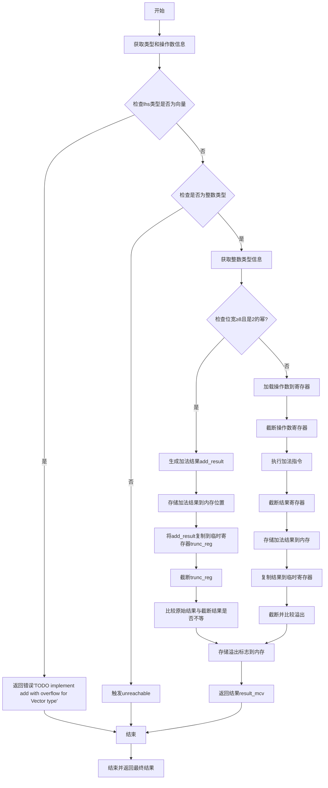

嗯，我需要为这个 Zig 函数 `airAddWithOverflow` 画一个流程图。首先，我要理解这个函数是做什么的。看起来像是处理加法溢出的情况，生成相应的机器码或者中间代码？

首先，函数开始部分获取了一些类型信息和操作数。然后根据左边的类型是否是整数来决定不同的处理方式。如果是向量类型，就直接返回未实现的错误。如果是整数，再根据位宽是否是8位及以上且是2的幂来分两种情况处理。

当位宽满足条件时，执行加法操作，然后将结果存储到指定的内存位置。接着进行截断，比较是否有溢出，并将溢出标志存储到另一个内存位置。如果位宽不满足条件，可能需要将操作数加载到寄存器中，进行类似的加法、截断和溢出判断。

流程图中需要涵盖这些判断分支，比如处理向量类型、整数类型的不同情况，以及每种情况下的具体操作步骤，比如生成加法指令、设置内存、处理溢出等。还要注意错误处理和返回结果的部分。

可能的结构是：

1. 开始
2. 检查 lhs 类型是否为向量 → 是：返回错误；否：继续
3. 检查是否是整数类型 → 是：继续；否：其他处理（这里可能 unreachable）
4. 判断整数位宽是否符合条件（≥8且2的幂）
   a. 符合：生成加法结果，存储到内存，处理截断和溢出
   b. 不符合：加载操作数到寄存器，执行加法，截断，处理溢出
5. 存储结果和溢出标志到内存
6. 结束并返回结果

需要注意各个条件分支之间的连接，以及每个步骤中的具体操作，比如 `genSetMem`、`truncateRegister`、`genBinOp` 等。还要处理寄存器的分配和释放，这部分可能在流程图中以子流程或步骤的形式出现。

可能需要用不同的形状表示判断（菱形）、操作（矩形）、开始/结束（椭圆）。确保每个条件分支清晰，步骤之间箭头正确。
================================================

该流程图完整展现了函数逻辑：
1. 初始类型判断和错误处理分支
2. 整数类型处理分为两种路径：
   - 标准位宽处理：直接运算和溢出检测
   - 非常规位宽处理：寄存器加载和二次截断
3. 最终统一存储结果和溢出标志
4. 菱形节点表示条件判断，矩形节点表示具体操作，椭圆形表示起始/结束节点
5. 箭头方向准确反映程序控制流走向