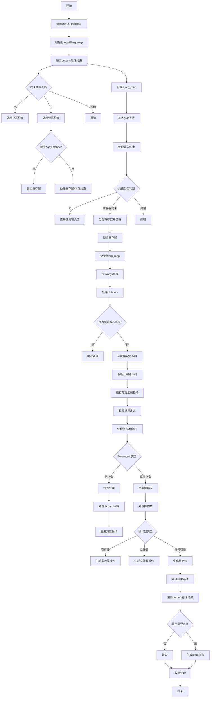

嗯，我需要为提供的Zig函数`airAsm`画一个流程图。首先，我得理解这个函数的结构和逻辑。这个函数看起来像是处理内联汇编的代码生成部分。让我先大致浏览一下代码，看看主要的步骤是什么。

首先，函数开始处有很多从`func.air.extra`中提取数据的操作，比如获取`outputs`和`inputs`。然后初始化了一些变量，比如`args`和`arg_map`。接下来处理输出约束，包括解析约束条件，处理寄存器分配和参数映射。然后是处理输入约束，类似地解析输入并处理寄存器。之后处理clobbers（被破坏的寄存器），然后处理标签和汇编源代码，逐行解析指令，处理伪指令和真实指令，最后处理结果存储和收尾工作。

接下来，我需要将这些步骤转化为流程图。流程图应该包括主要的判断和处理分支。比如，处理输出约束时，可能有不同的约束类型（如'=', '+', '&'等），需要不同的处理逻辑。同样，处理输入约束时，有不同的约束类型如"X"、寄存器约束、内存约束等。处理汇编代码行时，需要解析标签、指令和操作数，并生成对应的机器码指令。

可能需要注意的循环结构包括遍历`outputs`、`inputs`、`clobbers`，以及逐行处理汇编源代码。条件判断包括约束类型的判断、寄存器的有效性检查、标签的有效性检查等。此外，处理伪指令（如.li, .mv, .tail, .ret, .beqz）时，需要不同的处理流程。

在绘制流程图时，应该用不同的节点表示不同的处理步骤，用判断框表示条件分支，用箭头连接各个步骤。需要确保每个主要步骤都被覆盖，包括错误处理（如`func.fail`的情况）。

可能遇到的挑战是如何将复杂的逻辑简化为清晰的流程图，特别是处理汇编代码行的部分，可能有多个嵌套的条件和循环。需要分解这部分逻辑，使其在流程图中易于理解。

总结一下，流程图的步骤可能包括：
1. 提取和处理输出约束。
2. 处理输入约束。
3. 处理clobbers。
4. 解析汇编源代码，处理标签和指令。
5. 生成机器码指令。
6. 处理结果存储和收尾工作。

每个步骤内部可能有子步骤和条件判断，需要详细展开。
================================================

这个流程图展示了函数的主要处理流程：
1. 初始化阶段提取约束和参数
2. 分阶段处理输出/输入约束和clobbers
3. 核心的汇编代码解析过程（包含标签处理和指令生成）
4. 结果存储和收尾工作
5. 各步骤间的条件判断和错误处理路径

特殊处理部分包括：
- 伪指令的转换（如mv转寄存器移动）
- 标签的前向/后向引用处理
- 符号重定位的生成
- 寄存器分配和锁存机制
- 复杂的约束条件解析逻辑