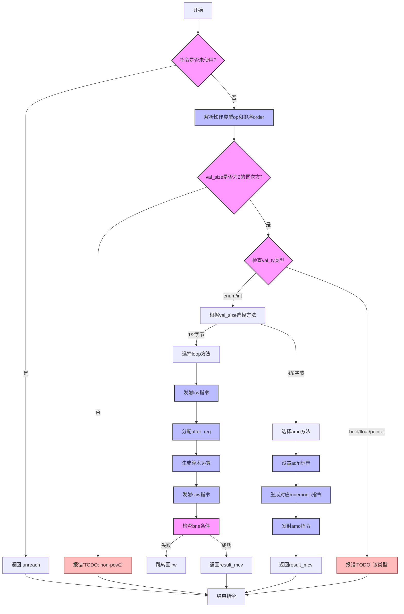

嗯，我需要为这个Zig函数生成一个流程图。首先，我得仔细阅读代码，理解它的逻辑结构。函数名为airAtomicRmw，看起来是处理原子操作的，比如原子交换、加减等。首先，函数获取一些参数，比如pt、zcu、pl_op和extra。然后根据操作类型（op）和排序（order）生成相应的机器码。

我需要确定主要的流程分支。比如，代码中有switch语句，根据method的不同（.amo或.loop）执行不同的路径。在.amo的情况下，选择对应的Mnemonic指令，并生成相应的汇编指令。而在.loop的情况下，会生成循环结构，包括跳转指令（比如bne）来实现重试机制。

另外，函数中有一些错误处理，比如检查val_size是否是2的幂次方，如果不是就返回错误。还有对不同类型（如enum、int、bool等）的处理，部分类型会导致TODO错误。

接下来，我需要将这些逻辑步骤转化为流程图的节点和分支。可能的步骤包括：

1. 函数开始，检查指令是否被使用，否则返回.unreach。
2. 解析操作类型和排序。
3. 检查val_size是否为2的幂次方，不是则报错。
4. 根据val_ty的类型，处理不同的情况，某些类型返回TODO错误。
5. 根据val_size选择method（.amo或.loop）。
6. 处理ptr_register和val_register的获取与释放。
7. 分配结果寄存器result_mcv。
8. 根据排序设置aq和rl。
9. 根据method分支处理：
   a. amo方法：选择正确的mnemonic，生成指令。
   b. loop方法：生成循环结构，包括加载、运算、条件跳转。
10. 最后返回结果，结束函数。

需要注意条件判断和循环结构的分支，以及错误处理的路径。比如，在检查val_size是否为2的幂次方时，如果不是，流程直接转向错误处理节点。同样，当遇到未实现的类型时，也会触发TODO错误。

另外，在.loop方法中，有跳转回前面的标签，形成循环，这在流程图中需要表示为一个循环结构，可能使用条件判断是否继续循环。

最后，确保所有可能的路径都被覆盖，包括正常流程和错误处理流程。需要将每个主要步骤和条件判断转化为流程图中的决策节点和动作节点。
================================================
