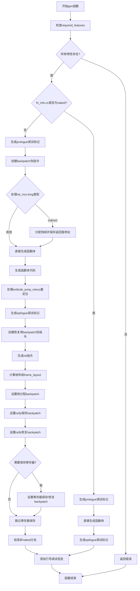

嗯，我现在要帮用户用Mermaid画出他们提供的Zig函数的流程图。首先，我需要理解这段代码的结构和逻辑。这个函数名为gen，接受一个Func指针参数，返回一个可能的错误。看起来这是一个代码生成函数，用于处理RISC-V 64架构的函数体生成。

首先，我会通读代码，了解整体流程。函数一开始检查了一些必需的特性（required_features），如果缺少某个特性，就返回错误。接着，根据函数调用约定是否为naked，分成了两个主要分支。如果调用约定不是naked，则生成函数的前言（prologue）和结尾（epilogue），处理栈分配、寄存器保存与恢复、返回指令等。否则，直接生成函数体，并处理调试信息。

接下来，我需要确定各个条件分支和循环结构。例如，inline for循环检查required_features，if条件判断fn_info.cc是否为naked，以及内部的switch语句处理不同的ret_mcv.long情况。还有处理exitlude_jump_relocs的循环，以及根据need_save_reg条件是否生成保存和恢复寄存器的指令。

在绘制流程图时，需要注意各个步骤的顺序和条件分支。开始节点是函数入口，然后依次是检查required_features的循环，接着是判断是否naked的分支。每个分支内部有不同的处理步骤，比如栈分配、保存寄存器、生成函数体、处理跳转重定位、恢复寄存器等。最后，无论哪个分支，都会处理调试信息，并结束函数。

需要注意的细节包括：循环结构如何处理，条件判断后的不同路径，以及各个伪指令（如addPseudo）的作用。此外，函数中的多个backpatch操作可能需要表示为不同的步骤或子流程。

可能遇到的困难是如何将复杂的控制流（如循环和多个条件分支）清晰地用Mermaid表示出来，同时保持流程图的简洁性。需要合理使用子图或者分组来组织不同的代码块，特别是当处理非naked分支时的大量操作。

最终，流程图应该从函数入口开始，按顺序展示各个步骤，用条件判断节点分支出不同的处理路径，并正确连接各个处理块，直到函数结束。
================================================
