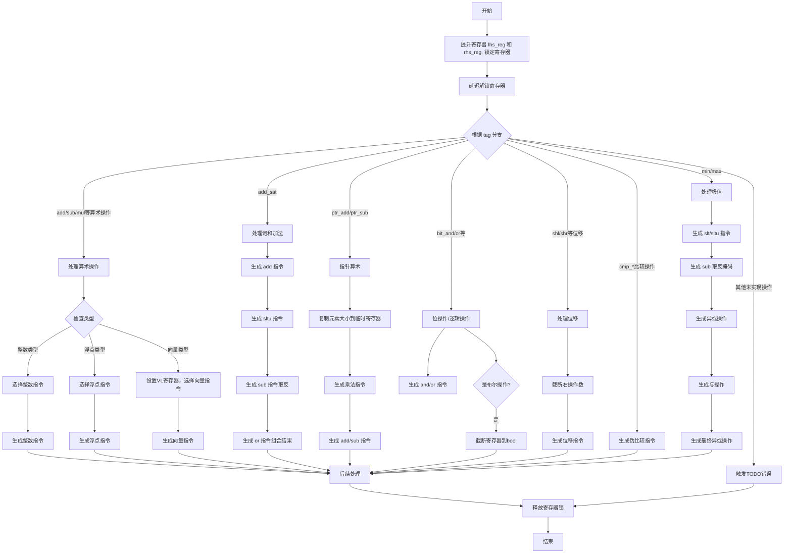

嗯，我需要为这个Zig函数genBinOp画一个流程图。首先，我得仔细阅读代码，理解它的结构。这个函数处理不同的二进制操作，比如加减乘除、位运算、比较等等。根据不同的操作类型和数据类型（整数、浮点、向量），它会生成不同的机器指令。

首先，函数开头处理了寄存器的提升和锁的管理，这部分可能在流程图的开始部分。然后根据不同的tag（操作类型）进入不同的分支。每个分支内部又有根据数据类型（int、float、vector）的进一步分支。比如，对于.add操作，如果是整数，会根据位宽选择不同的指令；如果是浮点数，选择不同的浮点指令；如果是向量，则处理向量相关的设置和操作。

接下来，还有一些特殊的处理，比如.add_sat、.ptr_add、.ptr_sub，这些需要额外的步骤，比如使用临时寄存器、计算元素大小等。位操作和逻辑操作（.bit_and、.bit_or）相对简单，直接生成对应的指令，但布尔操作需要截断结果到布尔类型。

对于位移操作（.shl、.shr），需要处理不同的位宽，并截断右操作数。比较操作（.cmp_eq等）生成伪比较指令。最后的.min和.max处理则使用了分支无的算法，涉及多个步骤和临时寄存器。

需要注意的是，代码中有很多条件判断和分支，流程图中需要明确每个判断的条件和对应的处理步骤。同时，错误处理（如func.fail）可能需要在流程图中体现为终止或错误出口。

现在，我需要将这些步骤转化为流程图的结构，使用mermaid的语法。可能需要从顶层开始，按主要操作分支展开，每个分支内部分析子条件，确保每个路径都被覆盖。可能的结构是：

1. 开始：提升寄存器，锁定
2. 根据tag分支到不同的处理块
3. 每个tag处理块内部分析数据类型（int、float、vector等）
4. 生成对应的指令
5. 处理特殊操作（如add_sat的步骤较多）
6. 错误处理路径
7. 结束：释放寄存器锁，返回

需要确保每个可能的路径都有对应的节点和箭头，条件判断用菱形表示，处理步骤用矩形，错误出口用特殊标记。可能还需要处理循环或重复结构，但看起来这个函数主要是线性分支结构，没有循环。

需要注意代码中的defer语句，释放寄存器锁是在处理完成后执行的，所以在流程图中应该在各个分支结束后统一处理。可能需要将defer操作放在流程图的末尾部分。

另外，对于某些操作需要生成多个指令，比如.add_sat需要多个指令步骤，这些步骤需要详细展示在对应的分支中。

最后，确保所有可能的错误情况（如unsupported操作）都有对应的错误节点，例如“TODO”提示的部分。
================================================

流程图说明：
1. 流程从寄存器提升和锁定开始
2. 根据操作类型(tag)分为多个主要分支
3. 每个分支处理对应的指令生成逻辑：
   - 算术运算根据数据类型选择不同指令
   - 饱和加法需要多步组合指令
   - 指针运算涉及元素大小计算
   - 位操作包含布尔截断处理
   - 极值计算采用分支无算法
4. 所有路径最终都会释放寄存器锁
5. 未实现操作会触发错误路径
6. 指令生成后统一进行后续处理