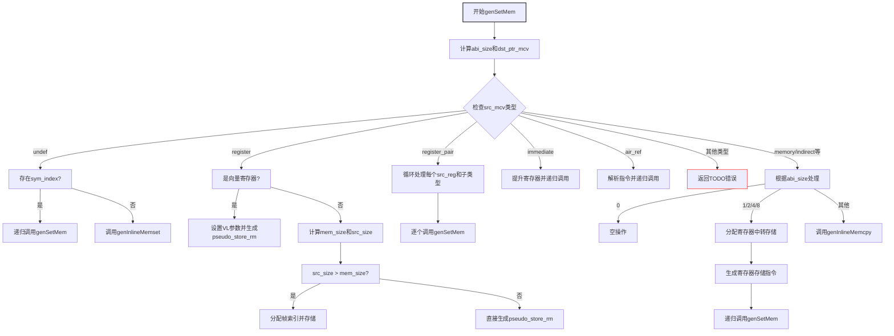

嗯，我现在要尝试理解这个名为genSetMem的Zig函数，并画出它的流程图。首先，我需要仔细阅读代码，理解各个部分的功能和逻辑流程。

首先，函数genSetMem的参数包括func指针、base（内存基址）、disp（位移）、ty（类型）、src_mcv（源MCValue）。看起来这个函数的作用是根据不同的源MCValue类型，生成设置内存的指令。

接下来，函数一开始获取pt和zcu，然后计算abi_size，即类型的ABI大小。然后根据base的类型（寄存器或帧），构造目标指针dst_ptr_mcv。

然后是一个大的switch语句，根据src_mcv的不同类型进行处理。比如，如果是undef，可能会调用genInlineMemset；如果是register，需要处理向量寄存器的情况，或者普通寄存器，生成相应的存储指令；如果是register_pair，则拆分类型并逐个处理；还有立即数、air_ref等其他情况。

我需要理清每个分支的逻辑，并确定各个条件之间的流程。例如，当src_mcv是register时，首先检查是否是向量寄存器，如果是，处理vsew、vlmul等设置，然后生成pseudo_store_rm指令。否则，处理普通寄存器的存储，可能需要分配临时帧索引，或者直接存储到内存。

在处理每个case时，注意是否有递归调用genSetMem的情况，比如在undef的情况下，如果存在sym_index，就会递归调用genSetMem。还有在register_pair的情况下，循环处理每个部分。

此外，需要注意错误处理，比如try的使用，可能影响流程的分支。不过，在流程图中可能不需要详细处理错误路径，主要关注正常流程。

接下来，我需要将这些逻辑步骤转化为流程图的结构。使用Mermaid的流程图语法，开始节点是函数入口，然后根据不同的src_mcv类型分支出不同的处理路径。每个分支内部根据条件进一步细分，比如abi_size的不同值，是否向量寄存器等。

可能的结构如下：

1. 函数开始，计算abi_size和dst_ptr_mcv。
2. 根据src_mcv的类型进入不同的分支：
   a. undef: 处理符号或调用genInlineMemset。
   b. register: 检查是否是向量寄存器，处理向量存储或普通存储。
   c. register_pair: 拆分类型，循环处理每个部分。
   d. immediate: 提升寄存器，递归调用genSetMem。
   e. 其他情况：处理或返回TODO错误。
   
在每个分支内部，可能还有子条件，比如abi_size是否为0、1-8或其他，或者是否涉及帧分配等。

需要注意循环结构，如register_pair中的循环处理每个src_reg。另外，递归调用如genSetMem自身也需要在流程图中表示出来。

最后，确保所有可能的路径都被覆盖，包括默认情况下的TODO错误。
================================================
