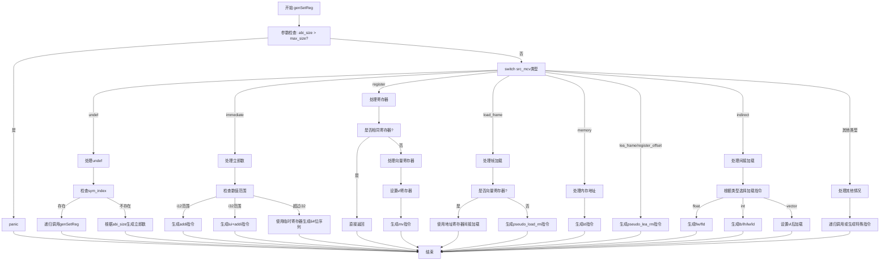

好的，我需要为给定的Zig函数`genSetReg`绘制一个流程图。首先，我需要理解这个函数的结构和逻辑流程。这个函数的作用是将一个源MCValue（可能是立即数、寄存器、内存地址等）设置到目标寄存器中，处理不同类型的源值和目标寄存器，并生成相应的机器指令。

首先，我会通读整个函数，识别主要的控制流分支。函数开头有一些参数检查，比如`abi_size`是否超过`max_size`。然后根据`src_mcv`的不同类型，进入不同的处理分支，比如`.immediate`、`.register`、`.load_frame`等。每个分支内部可能有更复杂的逻辑，比如生成不同的指令序列或处理不同的寄存器类型。

接下来，我需要将每个`switch`语句和条件判断转换为流程图中的决策节点。例如，当`src_mcv`是`.immediate`时，会根据数值的大小生成不同的指令（如`addi`、`lui`和`addi`组合，或者更复杂的64位处理）。对于`.register`的情况，需要处理是否相同寄存器，以及向量寄存器的特殊情况。

同时，需要注意函数中的递归调用，比如在处理`.undef`时可能会递归调用`genSetReg`。在流程图中，这可能表示为子流程或直接指向相应的处理步骤。

此外，异常处理和错误情况（如`panic`或`fail`）也需要在流程图中标出，通常作为终止节点或错误处理分支。

最后，需要确保所有可能的路径都被覆盖，并且流程图的结构清晰，便于理解整个函数的逻辑流程。可能需要将复杂的部分拆分为子图，以保持主图的简洁性。
================================================
