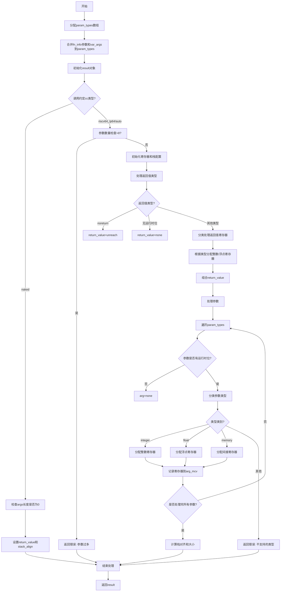

嗯，我需要为这个名为resolveCallingConventionValues的函数画一个流程图。首先，我需要理解这个函数的结构和逻辑。让我仔细看看代码。

这个函数接受一个函数指针func，函数类型信息fn_info，以及可变参数var_args，返回一个CallMCValues结构。看起来主要是处理调用约定，特别是针对RISC-V架构的调用约定。

函数开始处声明了一些变量，比如pt、zcu、ip，然后分配了param_types的内存，接着将fn_info的参数类型和var_args合并到param_types数组中。之后初始化了一个result对象，其中包含args数组、return_value、stack_byte_count和stack_align。这里需要注意的是return_value和stack_align在后续被赋值。

然后根据调用约定cc的不同，进入不同的处理分支。首先是.naked的情况，这里检查args的长度是否为0，并设置返回值和栈对齐。接着是.riscv64_lp64和.auto的情况，这里处理参数和返回值，涉及整数寄存器和浮点寄存器的分配，以及可能的栈传递。

在处理返回值的部分，根据返回类型的不同情况（如noreturn、无运行时位等），设置不同的return_value。然后处理参数，遍历param_types，根据类型分类（整数、浮点、内存等）分配寄存器或处理栈传递。如果参数超过寄存器数量，可能需要使用栈，但目前代码中似乎还没有完全处理这种情况，返回了一个错误提示。

接下来，我需要将这些步骤转化为流程图。流程图应该包括开始和结束节点，判断分支（如不同的调用约定），循环处理参数，以及可能的错误处理路径。

需要注意的是，代码中有多个条件判断，比如switch语句中的不同cc情况，for循环处理参数类型，以及内部的分类处理。此外，错误处理如func.fail的调用也需要在流程图中体现。

可能的结构如下：
1. 开始节点：函数入口。
2. 分配param_types数组。
3. 合并fn_info和var_args到param_types。
4. 初始化result对象。
5. 根据cc的值分支处理：
   a. .naked的情况：设置返回值，栈对齐。
   b. .riscv64_lp64或.auto：处理返回值和参数分配。
6. 处理返回值部分，根据返回类型分类。
7. 处理参数部分，遍历每个参数类型，分配寄存器或处理栈。
8. 错误处理路径，如参数超过8个，不支持的类等。
9. 最后设置stack_byte_count并返回result。

可能需要使用条件判断节点、循环节点、处理步骤节点以及错误节点。另外，代码中的错误处理（如返回func.fail）应该作为流程中的异常路径。

需要注意的是，代码中的一些部分可能还未完全实现，比如栈传递参数的处理，这在流程图中可能需要标注为待办或错误路径。

现在，我需要将这些步骤转化为mermaid的流程图语法，确保每个步骤和分支正确表示，并保持逻辑的连贯性。
================================================

流程图说明：
1. 函数入口分配参数类型数组并合并参数。
2. 根据调用约定类型分支处理：
   - naked约定直接设置返回值并结束。
   - riscv64_lp64/auto约定进行参数数量校验。
3. 返回值处理根据类型分为三种情况：
   - noreturn、无运行时位、常规类型（寄存器分配）。
4. 参数遍历时对每个参数进行类型分类：
   - 整数/浮点/内存类型分别分配对应寄存器。
   - 不支持的类型直接返回错误。
5. 最终计算栈对齐并返回结果，所有错误路径均指向终止节点。