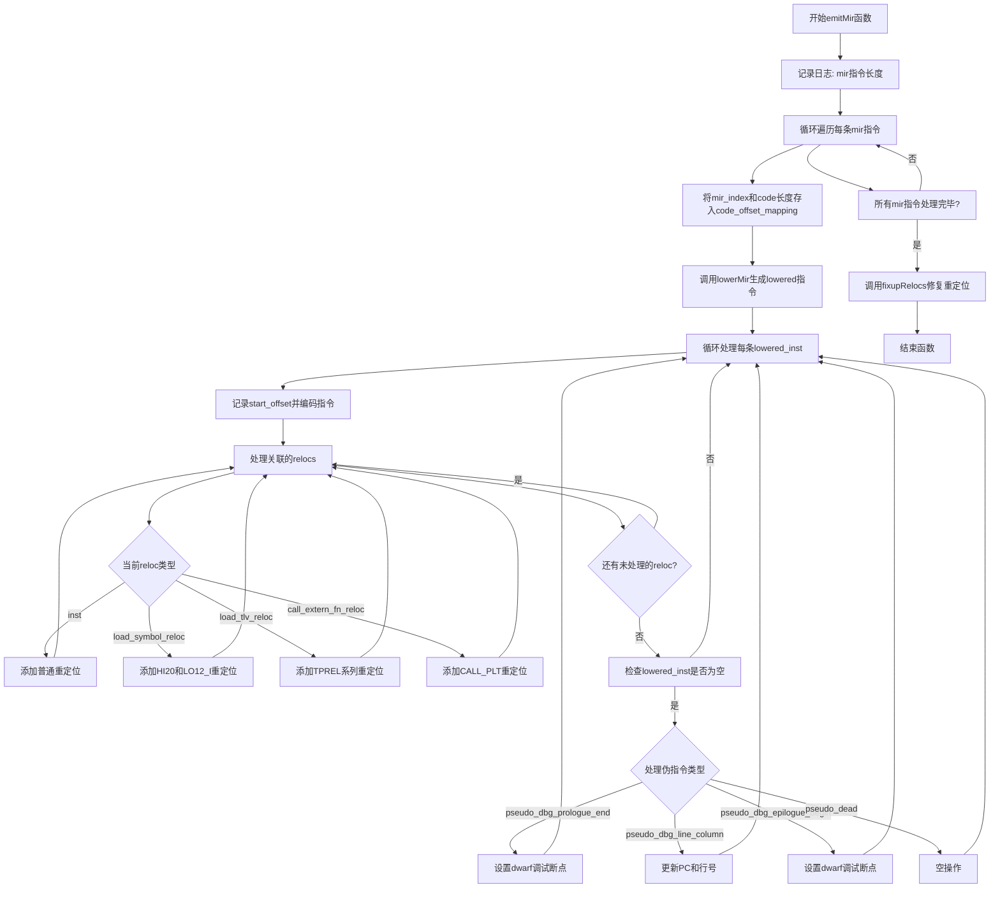

嗯，我现在需要根据提供的Zig代码中的emitMir函数，用Mermaid画出它的流程图。首先，我得仔细阅读这段代码，理解它的结构和逻辑流程。

函数开始于pub fn emitMir(emit: *Emit) Error!void {。首先，它获取了gpa（通用分配器），然后记录日志，显示mir指令的长度。接下来是一个循环，遍历所有的mir指令。循环内部，对于每个mir_index，它向code_offset_mapping添加条目，然后调用lowerMir方法来生成lowered指令。

之后，处理lowered的指令和相关的重定位（relocations）。这里有一个嵌套循环，遍历每个lowered_inst，并处理对应的relocs。对于每个reloc，根据不同的类型（如inst、load_symbol_reloc、load_tlv_reloc、call_extern_fn_reloc），进行不同的处理，比如添加不同的重定位条目到atom_ptr中。

处理完所有relocs后，检查是否有剩余的relocs未被处理，如果有的话会触发断言失败。然后，如果lowered的指令长度为0，处理一些伪指令（如pseudo_dbg_prologue_end、pseudo_dbg_line_column等），这些主要和调试信息相关，根据不同的调试输出类型（dwarf、plan9、none）执行不同的操作。

最后，循环结束后，调用fixupRelocs方法进行重定位的修复。

现在，我需要将这些步骤转化为流程图的结构。流程图通常从开始节点开始，然后按照顺序处理各个步骤，包括循环和条件判断。

首先，流程图的开始节点是“开始emitMir函数”。然后，记录日志，进入循环处理每个mir指令。在循环内部，处理code_offset_mapping，lowerMir，然后处理每个lowered_inst和其relocs。对于每个reloc，根据不同的类型分支处理，比如处理HI20和LO12_I重定位，或者TPREL相关的重定位，或者CALL_PLT重定位等。

处理完所有reloc后，检查是否还有剩余的relocs，如果没有，继续处理伪指令部分。根据伪指令的不同tag，处理调试信息，比如设置prologue结束、推进PC和行号、设置epilogue开始等。

最后，循环结束，调用fixupRelocs，结束整个函数。

需要注意的是，循环结构在流程图中应该用循环节点表示，比如for循环遍历mir指令和lowered_inst。条件判断如switch语句需要分支，比如处理不同的reloc类型或伪指令tag。

可能还需要处理错误情况，因为函数返回Error类型，但代码中大部分使用try，所以可能每个步骤都有可能抛出错误，但在流程图中可能不需要详细表示错误处理路径，除非特别重要。

现在，将上述步骤转化为Mermaid的流程图语法。开始节点，顺序执行各个步骤，循环结构用循环框，条件判断用条件分支。

需要注意的是，Mermaid的流程图语法中，循环可能需要用子图或循环标记来表示。例如，处理每个mir_i的循环可以用一个循环框包裹里面的步骤。

同样，处理lowered_inst和relocs的循环也需要嵌套的循环结构。

此外，处理不同的reloc类型需要用条件分支，例如判断target的类型是inst、load_symbol_reloc等，分别处理不同的情况。

对于伪指令的处理，同样需要根据不同的tag进行分支处理，比如pseudo_dbg_prologue_end、pseudo_dbg_line_column等。

在绘制过程中，需要保持流程的清晰，避免过于复杂。可能需要将一些复杂的处理步骤简化为子流程，比如处理relocs的部分可以作为一个子流程节点，展开后显示不同的分支。

最后，整个流程结束于fixupRelocs调用后结束函数。

现在，根据这些思考，开始构建Mermaid流程图的结构。
================================================
