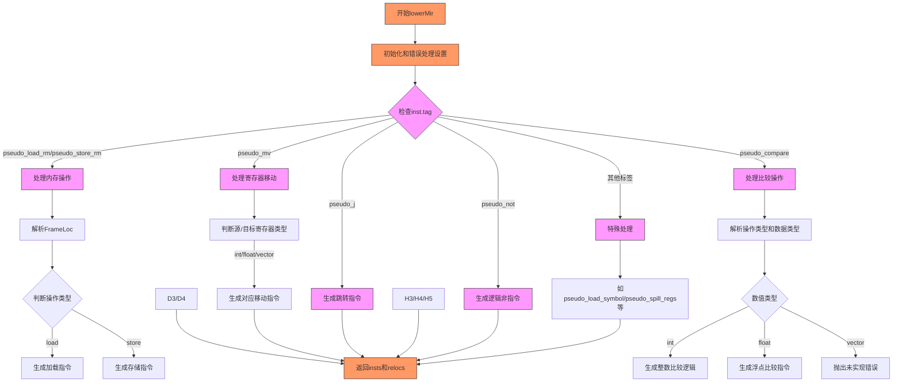

嗯，我需要帮用户用Mermaid画出这个Zig函数的流程图。首先，我得仔细看看这个函数的结构。这个函数叫做lowerMir，看起来是处理RISC-V架构的指令lowering，也就是将中间表示（Mir）转换为具体的机器指令。

首先，函数开始处有一些初始化和错误处理的代码，比如设置result_insts和result_relocs，然后根据不同的指令标签（inst.tag）进行处理。每个标签对应不同的操作，比如.pseudo_load_rm、.pseudo_store_rm、.pseudo_mv等等。

接下来，我需要理清每个case的处理流程。例如，当遇到.pseudo_load_rm时，会处理加载操作，根据不同的寄存器类型（int、float、vector）生成不同的指令。类似地，.pseudo_store_rm处理存储操作，.pseudo_mv处理寄存器间的移动，还有条件跳转、符号加载等等。

流程图应该从函数入口开始，然后根据不同的指令标签分支到不同的处理块。每个处理块内部可能还有条件判断，比如根据寄存器类型选择不同的指令。需要注意的是，有些case会直接返回或抛出错误，比如遇到不支持的操作时调用lower.fail。

可能的结构是：函数开始→初始化→检查inst.tag→根据不同的tag进入不同的处理分支→每个分支内部处理逻辑→生成指令→最终返回结果。错误处理部分需要标注可能出现的错误路径。

我需要确保每个分支都被正确表示，特别是那些有嵌套条件判断的地方，比如在.pseudo_load_rm中的switch (dest_reg_class)。此外，defer和errdefer的部分也需要考虑，但可能对流程图影响不大，可以简化处理。

最后，使用Mermaid的流程图语法，用不同的节点和箭头连接各个处理步骤，确保逻辑清晰，层次分明。可能需要使用子图来组织复杂的条件分支，或者用注释节点说明关键部分。
================================================
