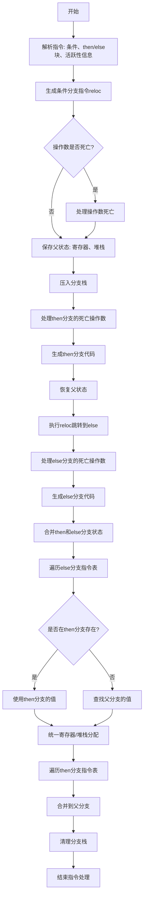

嗯，我现在需要分析这个用Zig写的函数`airCondBr`，并画出它的流程图。首先，我需要理解这个函数是做什么的。看起来这个函数处理条件分支，也就是类似if-else的结构，生成相应的机器代码。函数名中的`air`可能是指Zig编译器的中间表示（AIR），所以这个函数可能是代码生成的一部分，特别是针对SPARC64架构的。

让我先通读一遍代码，大致了解每个部分的功能。函数开始部分解析了一些指令数据，获取条件、then和else的代码块，以及活跃性信息。然后，生成一个条件分支的指令，可能是根据条件跳转到else部分。接着处理操作数的生命周期，如果条件操作数在这里死亡，就进行相应的处理。

接下来，函数保存了当前的寄存器分配和堆栈状态，因为接下来的then和else分支可能需要不同的资源分配。然后，生成then分支的代码，处理该分支中死亡的操作数，并生成对应的机器代码。完成then分支后，恢复到之前保存的父状态，准备处理else分支。

在处理else分支时，同样处理死亡的操作数，生成对应的代码。之后，需要合并两个分支中的寄存器分配和堆栈状态，确保两者的一致性。这里涉及到遍历两个分支的指令表，将它们的值统一，并生成必要的指令来调整寄存器和堆栈的位置。最后，清理分支栈，完成air指令的处理。

现在，我需要将这些步骤转化为流程图。流程图应该包括主要的判断点和处理步骤。可能的步骤包括：

1. 解析指令，获取条件和分支信息。
2. 生成条件分支指令。
3. 处理条件操作数的死亡。
4. 保存父状态的寄存器、堆栈等信息。
5. 处理then分支的死亡操作数，生成代码。
6. 恢复父状态，处理else分支的死亡操作数，生成代码。
7. 合并两个分支的状态，调整寄存器和堆栈。
8. 清理资源，结束指令处理。

在合并状态时，可能涉及到遍历两个分支的指令表，比较并统一它们的值。这里可能需要条件判断，例如检查指令是否在then或else分支中被覆盖，或者是否已经死亡。

需要注意的是，代码中有很多错误处理（try和errdefer），但在流程图中可能不需要详细展示每个错误处理路径，除非它们影响主要流程。此外，日志记录和调试信息也可以忽略，专注于主要控制流。

在绘制流程图时，使用不同的形状表示不同的步骤：矩形表示处理步骤，菱形表示条件判断，箭头表示流程方向。例如，生成条件分支后，可能需要判断是否操作数死亡，从而决定是否处理死亡。处理then和else分支后，合并状态时需要检查每个指令的状态，决定如何统一它们的值。

可能遇到的难点是如何准确表示合并分支状态的过程。这部分代码中有两个循环，分别处理else和then分支的指令表，可能需要将这些循环转化为流程图的循环结构，或者简化表示为“合并分支状态”的步骤，并在其中包含子步骤。

总结，流程图的大致结构应该是：

开始 -> 解析指令 -> 生成条件分支 -> 处理条件操作数死亡 -> 保存父状态 -> 处理then分支 -> 恢复父状态 -> 处理else分支 -> 合并状态 -> 清理资源 -> 结束。

其中，“处理then分支”和“处理else分支”内部可能有各自的步骤，例如处理死亡操作数和生成代码。合并状态部分需要详细展示如何处理两个分支的指令表，确保寄存器分配的一致性。
================================================
