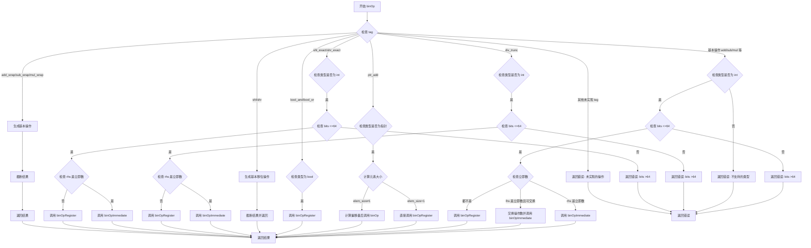

嗯，我需要帮用户用Mermaid画出这个Zig函数的流程图。首先，我得仔细看看这个函数的结构。函数是处理二进制操作的，根据不同的操作类型（tag）进行不同的处理。比如，加法、减法、乘法，还有逻辑操作等等。每个tag对应的处理逻辑不同，可能涉及到不同的数据类型，比如整数、浮点数、向量等。

首先，我会从函数的入口开始，函数接收多个参数，包括操作类型tag、左右操作数lhs和rhs，以及它们的类型lhs_ty和rhs_ty。然后，函数内部有一个大的switch语句，根据tag的不同进入不同的处理分支。

比如，第一个case处理.add、.sub等基本操作，接着检查类型是否为整数，如果是整数且位数小于等于64，则继续处理，否则报错。这里需要判断是否操作数是立即数，以及是否需要交换操作数。之后，生成对应的MIR指令，调用binOpImmediate或binOpRegister。

接下来还有其他分支，比如处理带有溢出的.add_wrap、.sub_wrap等，这里会先执行基本操作，然后进行截断处理。还有处理指针加法.ptr_add的情况，需要考虑元素大小，调整偏移量。逻辑操作.bool_and和.bool_or需要特殊处理，移位操作.shl、.shr也需要不同的处理方式。

在画流程图的时候，需要把这些分支都考虑进去，每个分支的判断条件和处理步骤都要表示清楚。可能需要使用不同的形状来表示判断节点（菱形）和处理步骤（矩形）。同时，需要注意循环和递归调用的情况，比如在处理.ptr_add时，可能会递归调用binOp函数。

需要注意的是，有些分支目前还没有实现，比如浮点数和向量的操作，会直接返回错误。这些也需要在流程图中体现出来，作为终止节点。

可能遇到的困难是如何将复杂的switch和嵌套的if-else结构清晰地转化为流程图，尤其是当有多个层级的判断时。需要确保每个条件分支都正确连接，并且处理步骤不遗漏。

总结一下，流程图的步骤大致如下：
1. 函数入口，接收参数。
2. 根据tag进入不同的处理分支。
3. 每个分支内部检查数据类型，处理立即数或寄存器操作数。
4. 生成对应的MIR指令，调用相应的函数（binOpImmediate或binOpRegister）。
5. 处理特殊情况，如溢出截断、指针调整、移位操作等。
6. 对于未实现的功能，返回错误。
7. 最终返回结果或错误。

需要确保每个判断节点都有明确的是/否分支，处理步骤连贯，并且错误情况正确终止。
================================================
