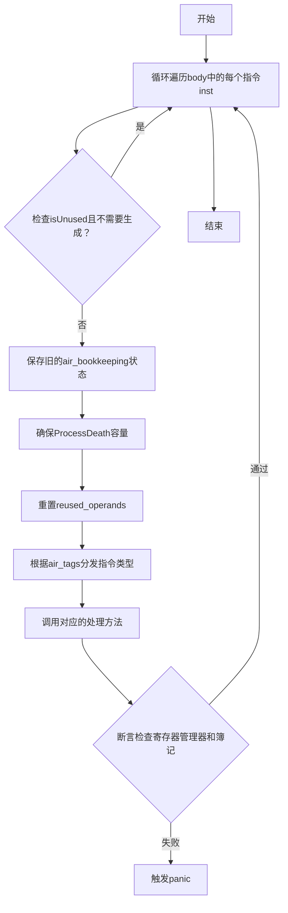

好的，我需要为提供的Zig函数`genBody`绘制流程图。首先，我会仔细阅读代码，理解其结构和逻辑。

函数`genBody`接受一个`self`指针和一个`body`参数，其中`body`是一个指令索引的切片。函数的主要部分是一个遍历`body`中每个指令的循环。对于每个指令，首先检查是否未被使用且不需要强制生成，如果是则跳过。接着处理各种不同的指令类型，根据`air_tags`中的标签调用不同的方法。每个case处理不同的操作，例如二元运算、内存操作、控制流等。处理完每个指令后，进行一些断言和簿记工作。

接下来，我需要将这个过程转化为流程图。流程图通常包括开始、结束、判断、处理步骤等元素。对于循环结构，需要表示循环的开始和结束，以及循环体内的各个步骤。

首先，流程图开始于函数入口。然后进入循环，遍历每个`inst`。在循环内部，首先检查`isUnused`和`mustLower`条件，如果满足则跳过当前指令。否则，执行一些初始化操作，如保存旧的`air_bookkeeping`，确保容量，重置`reused_operands`。然后根据`air_tags`进行多路分支处理不同的指令类型，每个分支调用相应的处理方法。处理完成后，进行断言检查，确保寄存器管理器和簿记的正确性。循环结束后，函数结束。

需要注意的是，由于`switch`语句中有很多case，每个case对应不同的处理函数，这在流程图中可能需要简化，避免过多的细节。可以将其概括为一个判断步骤，根据指令类型分发到不同的处理逻辑，而不需要列出所有可能的case。

此外，代码末尾的断言检查在每次循环迭代后执行，确保`air_bookkeeping`的正确性，这也需要在流程图中表示出来。

总结流程图的主要步骤：

1. 开始
2. 初始化参数
3. 循环遍历每个指令inst
   a. 检查是否跳过该指令
   b. 保存旧状态，准备处理指令
   c. 根据指令类型分发处理
   d. 处理后的断言检查
4. 结束

在绘制时，使用菱形表示判断（如是否跳过指令），矩形表示处理步骤，箭头表示流程方向。循环结构用回到循环开始的箭头表示。
================================================
