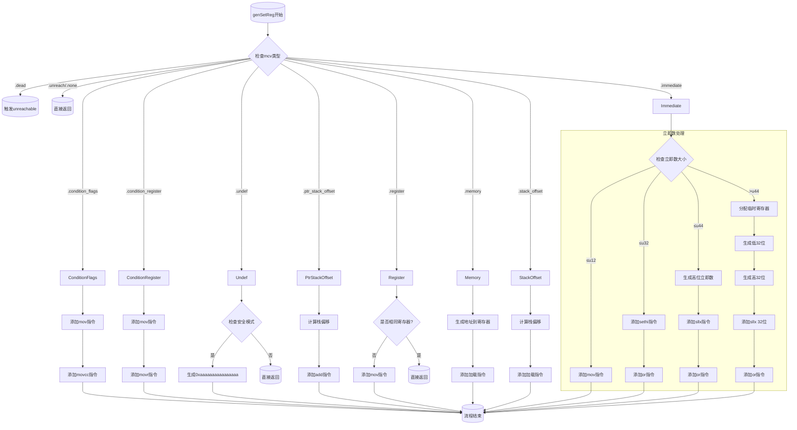

好的，我需要帮助用户将提供的Zig函数`genSetReg`转换为Mermaid流程图。首先，我需要理解这个函数的结构和逻辑。

函数`genSetReg`接受类型为`Type`的`ty`，寄存器`reg`和`MCValue`类型的`mcv`。它的主要作用是根据不同的`mcv`情况生成相应的机器指令。首先，我会逐一分析每个`switch`分支的处理流程。

1. **`mcv`的各个case分析**：
   - `.dead`：直接`unreachable`，表示不应该发生。
   - `.unreach`, `.none`：直接返回，不做任何操作。
   - `.condition_flags`：生成两个指令`.mov`和`.movcc`，涉及条件码和寄存器操作。
   - `.condition_register`：生成`.mov`和`.movr`指令，处理寄存器条件。
   - `.undef`：安全模式下生成立即数0xaaaaaaaaaaaaaaaa，否则直接返回。
   - `.ptr_stack_offset`：处理栈指针偏移，生成`.add`指令。
   - `.immediate`：根据立即数的大小分情况处理，可能生成多个指令（`.mov`、`.sethi`、`.or`、`.sllx`等），特别是对于大立即数需要临时寄存器。
   - `.register`：如果源寄存器和目标寄存器不同，生成`.mov`指令。
   - `.register_with_overflow`：未实现，直接`unreachable`。
   - `.memory`：加载内存地址到寄存器，然后生成加载指令。
   - `.stack_offset`：生成加载栈偏移的指令。

2. **流程分支**：
   - 每个`case`对应不同的处理路径，特别是`.immediate`分支有多个子条件（根据立即数大小）。
   - 需要注意递归调用的情况，例如在`.immediate`的最后一个子分支中，调用了`genSetReg`两次，并添加了其他指令。

3. **转换为流程图**：
   - 使用Mermaid的流程图语法，以`genSetReg`为起点，根据不同的`mcv`值分支出不同的处理块。
   - 每个case作为一个判断节点，处理完对应操作后流向结束。
   - 对于复杂的子条件（如`.immediate`），需要进一步分解为子流程，可能使用子图（subgraph）来组织。

4. **可能遇到的困难**：
   - 确保所有分支都被正确覆盖，特别是嵌套的条件判断。
   - 处理递归调用（如`.immediate`中的`genSetReg`调用）在流程图中的表示，可能需要简化或注释说明。
   - 保持流程图的清晰性，避免过于复杂导致难以阅读。

在绘制过程中，我需要确保每个判断节点正确引导到对应的操作块，并在适当的位置添加注释或说明，尤其是处理复杂逻辑的部分。例如，`.immediate`分支需要多个步骤，可能需要用子图详细展示。同时，注意错误处理（如`self.fail`）的流向，但原函数中这些错误处理可能直接返回错误，因此在流程图中可以简化为终止节点。

最后，检查流程图是否准确反映函数的逻辑，包括所有case的处理步骤和可能的递归调用路径，确保没有遗漏重要的处理步骤。
================================================
