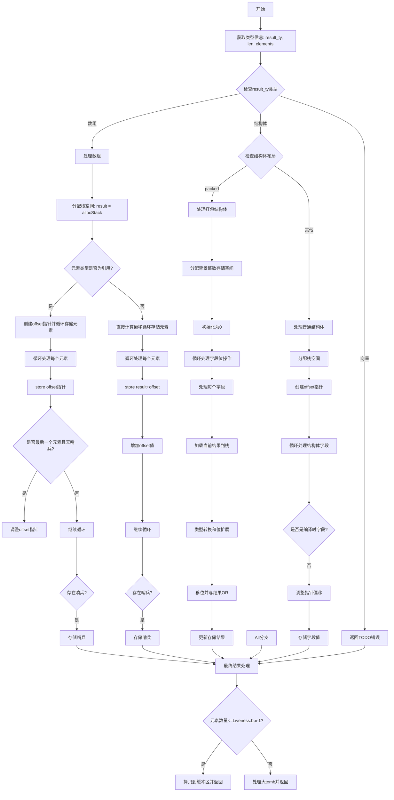

嗯，我需要为这个Zig函数画一个流程图。首先，我得理解这个函数的结构和逻辑。函数是airAggregateInit，看起来是处理聚合类型（比如数组、结构体、向量）的初始化。

首先，函数开始获取一些类型和长度信息，然后根据结果类型的不同（数组、结构体、向量等）分情况处理。对于数组，它分配栈空间，处理元素，考虑是否是引用类型，分情况存储元素。如果是结构体，又分打包结构体（packed）和普通结构体，打包结构体处理位操作，普通结构体处理字段偏移。向量部分还未实现，所以直接返回错误。最后处理结果并结束。

我应该把每个分支拆分开来，比如数组处理、结构体的packed和普通情况，以及最后的返回部分。流程图中需要体现出条件判断和循环操作，比如for循环处理每个元素。同时注意错误处理和未实现的部分。

可能的结构：开始 → 获取类型信息 → 判断类型 → 数组处理分支 → 结构体处理分支（再分packed和普通）→ 处理元素 → 存储结果 → 最后处理返回值。每个分支中的详细步骤需要细化，比如分配栈空间，循环处理元素，位操作等。

需要确保每个判断节点（如类型判断、是否是引用类型、是否打包结构体等）都正确分叉，循环部分用循环框表示。可能还需要标注一些重要操作，如allocStack、buildPointerOffset、store等。
================================================
