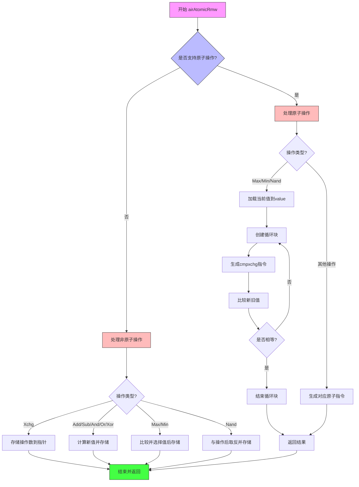

嗯，我需要帮用户把这段Zig代码的airAtomicRmw函数用Mermaid画流程图。首先，我得先理解这段代码的逻辑。看起来这个函数处理原子性的读-修改-写操作，根据不同的操作类型生成不同的Wasm指令。

首先，函数开始处获取了一些参数，比如指针、操作数、类型和操作类型op。然后，根据是否使用原子特性（cg.useAtomicFeature()），分成两个大的分支。如果支持原子操作，处理Max、Min、Nand这些需要循环比较交换（cmpxchg）的操作，而其他操作如Xchg、Add等则直接生成对应的Wasm指令。如果不支持原子操作，就模拟这些操作，比如加载、计算、存储。

接下来，我需要把这两个主要分支拆开。对于原子操作的情况，当op是Max、Min、Nand时，会创建一个循环块，进行cmpxchg操作。这里涉及到加载当前值，比较，然后根据条件更新值。这部分需要循环结构。而其他操作则直接生成对应的指令，不需要循环。

对于非原子操作的情况，处理各个op的方式不同，比如Xchg直接存储，其他操作可能需要计算后再存储。特别是Max/Min需要比较后选择值，Nand需要与操作后再取反。

在画流程图时，应该从函数入口开始，根据useAtomicFeature()判断分为两个大的流程分支。每个分支内部根据不同的op类型进行不同的处理步骤。需要注意条件判断和循环结构的表示。

可能需要注意的点：在原子操作的分支中，处理Max/Min/Nand时有一个循环块，用startBlock和endBlock包围，这应该在流程图中用循环结构表示。而其他操作则是顺序执行。非原子分支中的各个op处理方式不同，需要不同的处理步骤。

可能需要将每个case转化为不同的流程节点，并使用条件判断来连接它们。确保每个操作类型都有对应的处理路径，并正确连接到结束部分（finishAir）。
================================================
