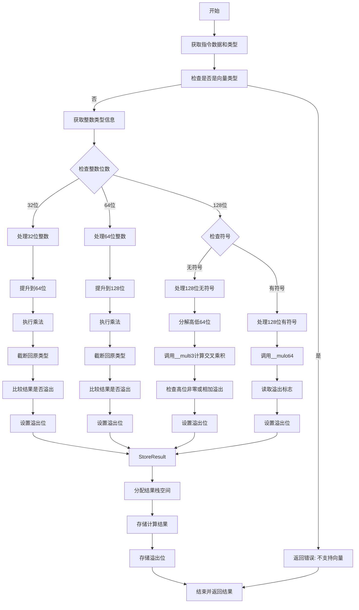

嗯，我需要帮用户把提供的Zig函数`airMulWithOverflow`用Mermaid流程图画出来。首先，我要理解这个函数的结构和逻辑流程。

函数一开始获取指令的数据类型和操作数，然后处理向量类型，如果发现是向量就返回错误。接着处理不同类型的整数溢出乘法，比如32位、64位、128位的有符号和无符号整数。对于32位和64位整数，函数会进行类型提升，乘法后再截断，比较结果是否溢出。对于128位无符号整数，分解成高位和低位进行计算，调用intrinsic函数，处理各种交叉相乘的情况，最后判断溢出。有符号的128位整数则调用不同的intrinsic函数并检查溢出位。

接下来，我需要将这些步骤分解成流程图中的各个节点。每个条件判断（如检查整数位数、符号）会有不同的分支。要注意各个分支的处理流程，比如32位处理、64位处理、128位无符号和有符号的处理，以及最终的存储结果和设置溢出位。

可能遇到的难点是如何正确表示条件分支和循环结构，尤其是嵌套的条件判断。例如，当处理128位无符号整数时，有多个步骤和条件检查，需要清晰地展示这些步骤的顺序和关系。

另外，函数中使用了不同的intrinsic函数（如__multi3、__muloti4），这些在流程图中应作为处理步骤的节点。同时，局部变量的分配和释放（如overflow_bit、lhs_lsb等）也需要在流程中体现，但可能可以简化以避免图表过于复杂。

最后，函数的结尾部分将结果存储到栈上，并返回结果。这部分需要作为流程图的结束节点。

需要确保流程图逻辑清晰，步骤分明，每个条件分支都有明确的路径。使用Mermaid的语法，用不同的形状表示开始/结束、处理步骤、条件判断等。
================================================
