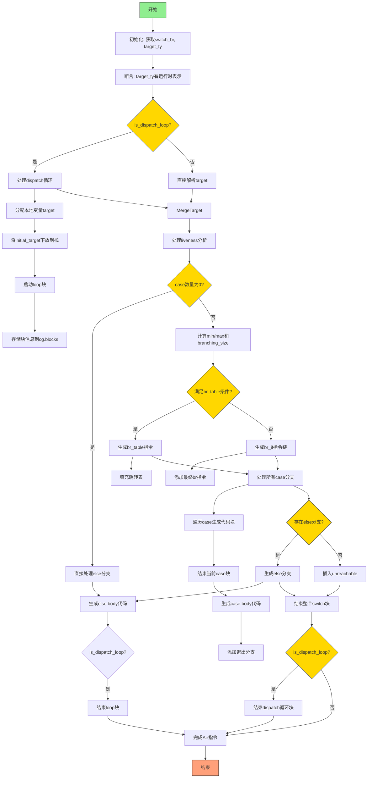

好的，我需要为这个Zig函数`airSwitchBr`绘制一个流程图。首先，我要理解这个函数的结构和逻辑流程。

函数开始处理一个switch分支指令，首先进行一些初始化和断言检查。然后根据`is_dispatch_loop`决定如何处理目标值，可能需要创建本地变量和启动循环块。接着处理liveness分析，处理不同情况的分支，包括else分支。

接下来，函数计算所有case的最小和最大值，确定分支的密度，以决定使用`br_table`还是多个`br_if`指令。这里有一个条件判断`use_br_table`，根据不同的情况生成不同的控制流。

然后，根据是否使用`br_table`，分别处理生成对应的WebAssembly指令。处理完所有case后，处理else分支或者插入`unreachable`指令。最后结束各个块，如果是dispatch循环的话结束循环块，并完成Air指令。

在绘制流程图时，需要注意条件分支，特别是`use_br_table`的判断，以及循环和块的开始与结束。每个case的处理和分支的跳转需要明确表示。同时，异常处理和资源释放（如`defer`）的位置也需要考虑进去。

可能的结构是：开始 -> 初始化 -> 处理目标值 -> 计算min/max -> 判断是否使用br_table -> 生成对应指令 -> 处理各个case -> 处理else或unreachable -> 结束块 -> 返回结果。

需要确保每个判断点和循环结构正确连接，块之间的嵌套关系清晰。可能需要使用子流程来表示循环和块结构，比如dispatch loop和switch block的开始与结束。
================================================
