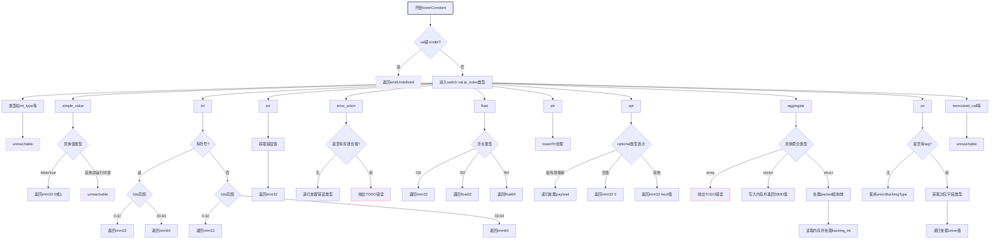

好的，我需要帮助用户将提供的Zig函数`lowerConstant`转换成Mermaid流程图。首先，我需要仔细阅读并理解这个函数的逻辑结构。这个函数的作用是处理不同类型的常量值，并为WebAssembly生成相应的表示。

首先，函数开始处有一些前置检查，比如断言`!isByRef(ty, zcu, cg.target)`，然后处理`val.isUndefDeep(zcu)`的情况，返回未定义值。接着，通过一个大的`switch`语句，根据`ip.indexToKey(val.ip_index)`的结果来处理不同的类型。

接下来，我需要分析每个`case`分支的处理逻辑。例如，处理`.int_type`等类型时直接`unreachable`，因为这些是类型而非值。处理`.simple_value`时，针对不同的布尔值返回对应的`imm32`。对于整数类型，根据有符号和无符号以及位数不同，返回`imm32`或`imm64`。错误类型需要获取错误值并转换为整数。聚合类型如数组、向量、结构体等有各自的处理方式，例如结构体需要处理打包存储的情况，向量需要写入内存缓冲区等。

在处理过程中，有些情况会导致`cg.fail`抛出错误，例如处理带有非零负载的错误联合类型时，暂时不支持，返回TODO错误。此外，对于指针类型，调用`lowerPtr`方法处理。

我需要将所有这些逻辑分支转化为流程图中的不同节点和判断条件。流程图应该从函数入口开始，依次处理各种情况，每个条件分支对应不同的处理步骤，直到最终返回相应的`WValue`。

需要注意的是，有些分支可能包含嵌套的`switch`或条件判断，例如在`.int`类型中，根据有符号和无符号以及位数进一步分支。这些都需要在流程图中明确表示出来，可能需要使用菱形判断框来表示条件分支。

另外，对于`unreachable`的情况，可以在流程图中标注为终止节点或直接结束流程。错误处理部分（如`cg.fail`）也需要作为可能的出口路径。

最后，确保流程图的逻辑与代码结构一致，涵盖所有可能的分支，并且结构清晰，便于理解。
================================================
