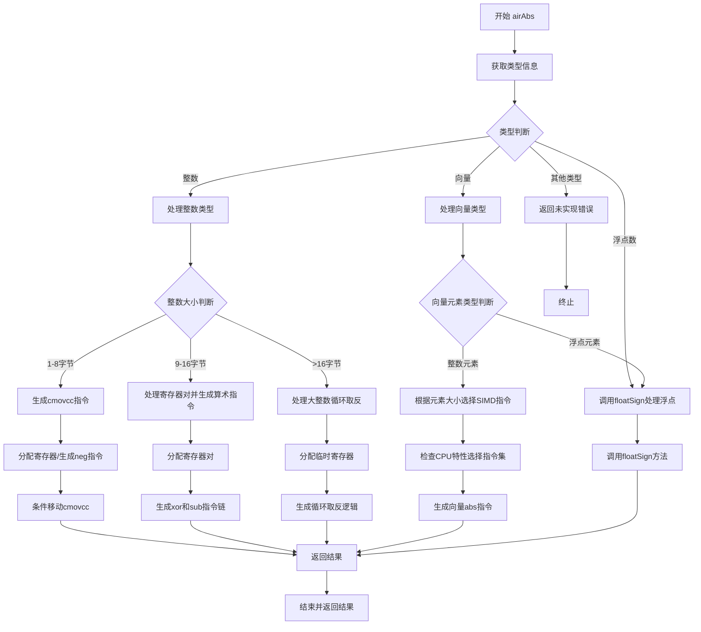

嗯，我需要为这个Zig函数`airAbs`画一个流程图。首先，我得理解这个函数的结构和逻辑。这个函数处理不同数据类型的绝对值操作，包括整数、浮点数和向量类型。看起来主要是针对x86_64架构生成机器码。

首先，函数开始获取类型信息，然后根据不同的类型（整数、浮点数、向量）进行分支处理。对于整数类型，又根据大小分为不同的处理方式：1-8字节、9-16字节，以及更大的情况。每种情况生成不同的汇编指令，比如使用`cmovcc`指令或者循环处理大整数。浮点数和向量类型则调用不同的方法，如`floatSign`。

我需要将这些分支逻辑转化为流程图。首先，函数入口，然后判断类型是否为整数、浮点数或向量。对于整数，进一步按大小分情况处理。每个情况下有不同的汇编生成步骤，可能涉及寄存器分配、指令选择等。对于不支持的类型，返回错误。

需要注意循环结构，例如处理大整数时的循环。另外，条件判断如是否重用操作数寄存器，是否支持特定的CPU特性（如AVX、SSSE3）也会影响流程。

可能的结构是：开始→解析类型→分支到整数/浮点/向量处理→根据大小进一步分支→生成对应汇编→结束。每个分支内部可能有子流程，比如寄存器分配、指令生成、错误处理等。

需要确保所有条件分支都被覆盖，比如`switch`语句中的每个`case`。可能用菱形表示判断，矩形表示操作，箭头连接流程。例如，判断类型是否为整数，如果是，再判断大小，然后进入对应的处理块。如果否，检查是否是浮点或向量，依此类推。

另外，错误处理部分，比如`self.fail`的情况，也需要在流程图中体现，可能作为终止节点。

可能需要多次细化，先画出主要分支，再逐步添加细节，如寄存器分配、指令生成步骤、循环结构等。确保流程清晰，逻辑正确。
================================================
