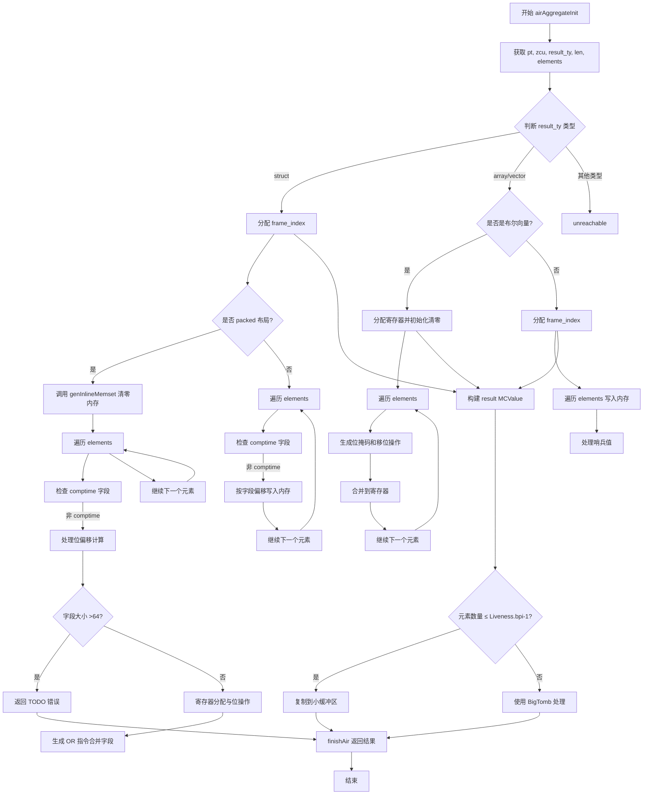

嗯，我需要帮用户画出这个Zig函数的流程图。首先，我得仔细看看这个函数的代码结构。函数是airAggregateInit，属于CodeGen的一部分，处理结构体和数组的初始化。

首先，函数开头获取了一些变量，比如pt、zcu、result_ty等。然后根据result_ty的类型标签（struct、array/vector）进行不同的处理。对于结构体，如果是packed布局，需要处理位偏移，生成内存设置和字段赋值。如果是普通结构体，则按字段偏移赋值。数组或向量部分，如果是布尔类型的向量，会用寄存器进行位操作，否则分配栈帧，逐个设置元素。

接下来，我需要理清每个分支的条件和处理步骤。比如，当处理packed struct时，会调用genInlineMemset清零内存，然后遍历每个元素，处理位偏移，可能涉及到寄存器的分配和位操作。对于数组，可能需要分配栈空间，逐个写入元素，并处理哨兵值。

在流程图中，应该从函数入口开始，根据不同的类型分支出struct、array/vector等处理路径。每个分支内部有循环处理元素，条件判断（比如是否comptime字段、位偏移是否超过64位等），以及相应的操作如寄存器分配、位运算、内存写入等。

还需要注意错误处理，比如当遇到大字段时返回TODO错误。最后，函数根据元素数量处理Liveness的big tomb，并返回结果。

可能遇到的难点是正确表示条件判断和循环结构，特别是处理packed struct时的位操作部分。需要确保每个分支和循环都清晰地在流程图中体现出来，使用正确的符号表示判断、循环、操作步骤等。
================================================
