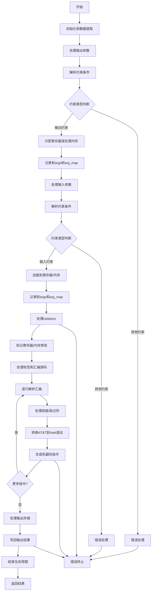

嗯，我需要为这个Zig函数`airAsm`画一个流程图。首先，我得仔细读一遍代码，理解它的结构和逻辑流程。看起来这个函数是用来处理内联汇编指令的，涉及到寄存器分配、约束处理、输入输出参数处理，以及生成机器码。

首先，函数开始的时候，会获取一些上下文信息，比如`pt`和`zcu`。然后从`self.air`中提取指令的数据，包括类型和负载。接着处理`extra`数据，获取输出和输入的参数列表。这里用到了`ty_pl`和`extra`，可能需要了解这些结构的具体内容。

接下来，初始化一些变量，比如`result`、`args`和`arg_map`。`args`是一个动态数组，用来保存输出和输入的MCValue（可能是机器码值）。`arg_map`是一个哈希表，用来映射参数名到索引。然后处理输出参数，解析约束条件，分配寄存器或处理内存地址。这部分有很多条件判断，比如约束条件是否以`=`、`+`开头，或者是否是早期破坏约束（`&`）。需要处理不同类型的寄存器类（如gp、x87、sse），以及内存约束`m`等。

处理完输出后，开始处理输入参数，同样解析约束条件，加载输入值到寄存器或内存位置。这里也需要处理不同类型的约束，比如`r`、`f`、`x`、`i`、`m`等，并生成对应的机器码值。如果输入是立即数，需要确保其值在编译时已知。

然后处理`clobbers`部分，标记被内联汇编修改的寄存器或内存，可能需要溢出`eflags`。接着处理标签（`.cfi_*`指令），生成伪指令，处理标签的定义和引用，解决未定义的标签问题。

接下来，解析汇编源代码，逐行处理每一条指令，处理前缀、助记符、操作数，转换AT&T语法到Intel语法，生成对应的机器码指令。这里涉及到操作数的处理，比如寄存器、立即数、内存地址、标签引用等。对于每个操作数，需要解析其类型和修饰符，生成对应的操作数结构。

最后，处理输出参数的存储，确保结果正确写入目标位置。然后处理生命周期的结束，记录结果，完成整个指令的处理。

在画流程图时，需要将上述步骤分解成不同的节点，包括初始化、处理输出、处理输入、处理clobbers、处理标签、解析汇编代码、生成机器码、处理存储和结束生命周期等步骤。每个步骤中的条件判断和循环也需要表示出来，比如处理每个输出和输入的循环，解析每行汇编代码的循环，处理标签引用的条件判断等。

需要注意的是，代码中有很多错误处理，比如`return self.fail(...)`，这在流程图中可能需要表示为错误终止节点或者异常流程。同时，寄存器的分配和释放也需要在流程中体现，尤其是在处理输出和输入时的寄存器锁定和解锁。

可能还需要考虑一些辅助函数的作用，比如`registerAlias`、`parseRegName`、`copyToTmpRegister`等，但在流程图中可能不需要详细展开，除非它们对主流程有重要影响。

总结一下，流程图的大致结构可能如下：

1. 初始化和数据提取
2. 处理输出参数
   a. 解析约束条件
   b. 分配寄存器或处理内存
   c. 记录到args和arg_map
3. 处理输入参数
   a. 解析约束条件
   b. 加载值到寄存器或内存
   c. 记录到args和arg_map
4. 处理clobbers
5. 处理标签和汇编源代码解析
   a. 逐行处理汇编指令
   b. 转换语法，生成机器码
6. 处理输出存储
7. 结束生命周期，返回结果

每个步骤中的条件分支和循环需要详细表示，确保流程图的准确性和完整性。
================================================

流程图说明：
1. **初始化和数据提取**：从AIR指令中提取类型、负载、输出/输入参数
2. **输出处理**：
   - 解析约束条件（=、+、&等）
   - 根据约束分配寄存器或处理内存地址
   - 建立参数映射关系
3. **输入处理**：
   - 解析输入约束（r、m、i等）
   - 将输入值加载到指定位置
4. **clobbers处理**：
   - 标记被修改的寄存器和内存
   - 处理特殊标志寄存器
5. **汇编解析**：
   - 逐行处理汇编源代码
   - 转换语法并生成机器码
   - 处理标签引用和跳转
6. **结果写回**：
   - 将寄存器结果写回内存（如果需要）
7. **生命周期管理**：
   - 更新寄存器使用状态
   - 完成指令处理并返回结果

各步骤间通过菱形节点处理错误条件，所有错误路径最终汇聚到错误终止节点。处理过程中包含多个循环结构（如逐行解析汇编指令），并通过条件判断处理不同类型的约束和操作数。