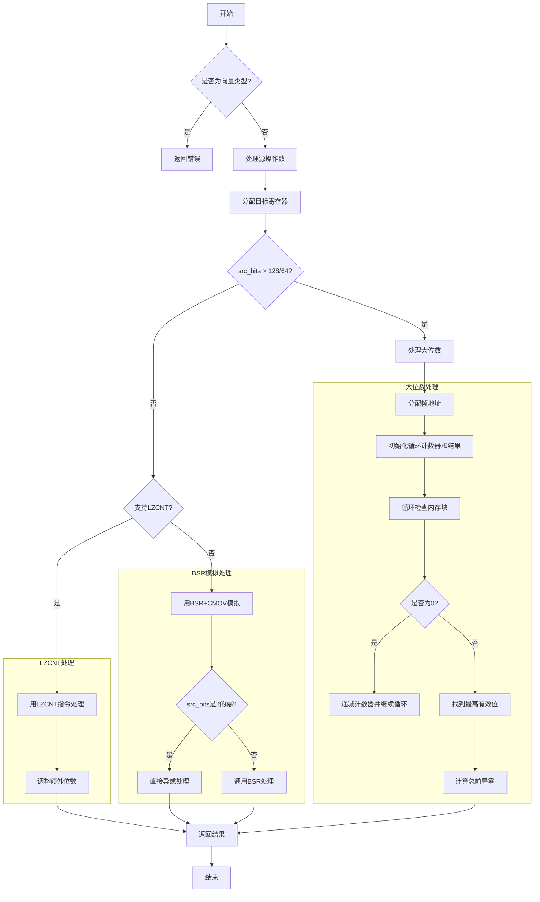

嗯，我现在要理解这个Zig函数`airClz`的流程，然后用Mermaid画出它的流程图。首先，这个函数的作用应该是处理计算前导零（CLZ，count leading zeros）的指令生成。从代码里看到，它处理不同的情况，比如是否有LZCNT指令支持，不同位数的处理方式等等。

首先，函数开始的时候，会做一些初始化操作，比如获取`pt`、`zcu`和`ty_op`。然后进入一个`result`块，这里可能有多个分支条件。接下来，它会处理向量类型（vector），如果输入是向量类型的话，暂时不支持，返回错误。

然后，处理源操作数，可能是立即数，这时候会复制到临时寄存器。接着分配目标寄存器`dst_reg`，并锁定相关寄存器。之后根据源类型的位大小`src_bits`和是否支持`lzcnt`特性，分为不同的处理路径。

如果`src_bits`超过128或64（取决于是否有LZCNT），则会进入一个较大的处理流程，这里可能需要处理多字节的情况，比如使用循环来检查每个字节块是否为0，然后计算前导零的数量。这里会涉及到分配帧索引，生成循环结构，比较内存中的值，跳转指令等。

如果支持LZCNT，那么根据不同的位大小（比如8位、64位、128位），生成对应的LZCNT指令，并进行调整，比如减去额外的位数。对于128位的情况，可能分成两个64位部分处理，然后组合结果。

如果不支持LZCNT，那么需要使用其他指令来模拟，比如BSR（位扫描反转），然后通过条件移动（CMOV）来处理特殊情况，比如全零的情况，并进行相应的调整。

在流程中，需要注意各种寄存器的分配和释放，条件跳转的位置，以及不同位大小和指令集支持情况下的不同处理路径。

接下来，我需要将这些步骤转化为流程图。首先，函数开始，检查是否是向量类型，如果是，报错。否则，处理源操作数，可能复制到临时寄存器。然后根据src_bits和是否有lzcnt进入不同的分支。

对于大的src_bits，进入循环处理，处理每个字节块，直到找到非零的块，计算索引，然后计算总前导零。对于支持lzcnt的情况，分不同位数处理，使用lzcnt指令，调整结果。对于不支持的情况，使用BSR和其他指令组合来模拟CLZ。

流程图中需要包括这些条件判断，不同路径的处理步骤，以及最终的返回结果。每个判断节点会有不同的分支，每个分支对应不同的代码块。需要确保所有可能的路径都被覆盖，包括不同位数（8、64、128等）和不同指令集支持的情况。

可能的结构是：开始 -> 检查向量类型 -> 处理源操作数 -> 检查src_bits大小和lzcnt支持 -> 分支到不同处理块 -> 生成对应指令 -> 调整结果 -> 结束。每个分支内部的具体步骤需要细化，比如循环处理、使用lzcnt指令、或者使用BSR和CMOV的组合。

需要注意的是，代码中有多个条件判断，比如src_bits是否大于某个值，是否支持lzcnt，是否是power of two等。这些都需要在流程图中体现出来，作为决策节点，引导到不同的处理逻辑。

最后，将所有处理路径汇总到结束，返回结果。可能还需要处理寄存器的释放和清理步骤，但流程图中可能不需要详细到每个寄存器的操作，而是关注主要的逻辑流程。
================================================

该流程图：
1. 以向量类型检查为入口
2. 分为大位数处理/LZCNT优化/BSR模拟三条主路径
3. 大位数路径包含内存循环检查机制
4. LZCNT路径根据位数分段处理
5. BSR路径根据是否是2的幂分两种子路径
6. 最终统一收敛到结果返回
7. 使用子图划分不同处理模块
8. 菱形节点表示条件判断
9. 矩形节点表示操作步骤