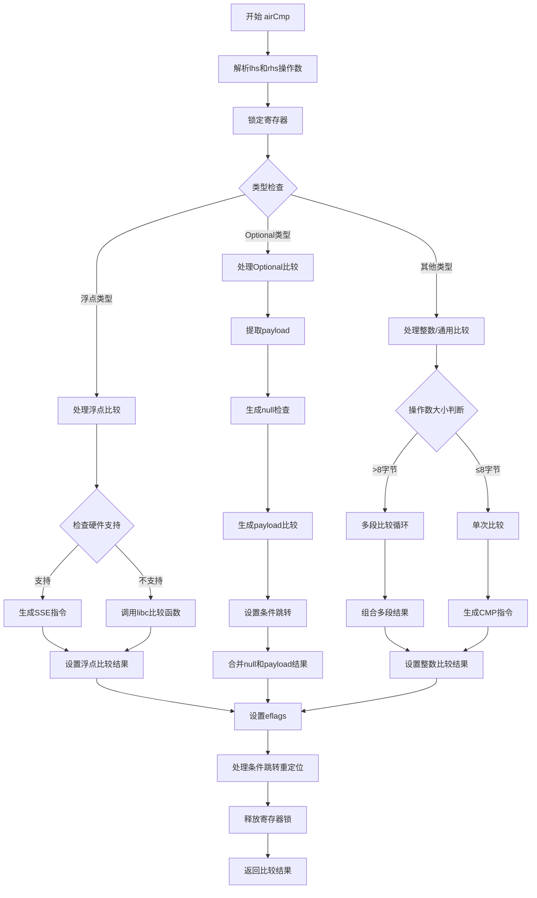

好的，我需要帮助用户将提供的Zig代码函数`airCmp`转换为Mermaid流程图。首先，我需要理解这段代码的功能和结构。

从代码来看，`airCmp`是一个处理比较操作的函数，可能属于编译器后端的一部分，用于生成机器码。函数接收两个操作数（lhs和rhs），处理不同类型的比较，包括整数、浮点数和可选类型（optional）。代码中有多个条件分支，处理不同的类型标签（如.float, .optional）和不同的比较操作符（如eq, lt等）。

首先，我需要确定函数的主要流程。函数开始于解析两个操作数（lhs和rhs），然后根据类型进行不同的处理。对于浮点数，检查硬件支持并生成相应的比较指令或调用库函数。对于可选类型，处理其有效负载（payload）的比较，并处理空值的情况。对于其他类型（如整数），则生成比较指令，处理可能的翻转操作符和不同大小的操作数。

接下来，我需要将这些逻辑步骤转换为流程图的节点和分支。可能的步骤包括：

1. 函数入口：开始处理airCmp。
2. 解析lhs和rhs的操作数，锁定寄存器。
3. 根据类型（float, optional, other）分支处理。
4. 对于浮点数：
   - 检查硬件特性，决定是否调用库函数或生成指令。
   - 生成相应的比较操作。
5. 对于optional类型：
   - 处理有效负载和空值的比较。
   - 生成条件跳转。
6. 对于其他类型（如整数）：
   - 处理操作数大小，可能翻转操作符。
   - 生成比较指令。
7. 处理条件结果，设置eflags。
8. 函数退出，返回结果。

需要注意条件分支之间的跳转，例如处理完optional类型后可能需要跳转到后续的条件设置部分。此外，代码中有多个defer语句用于解锁寄存器，这在流程图中可能需要表示资源管理。

可能的挑战是如何简洁地表示复杂的条件分支和循环（如处理多字节整数比较时的循环展开）。此外，代码中的错误处理（如try语句）可能需要异常流程，但用户可能只需要主要路径。

需要确认是否需要详细到每个条件判断，还是概括主要分支。例如，处理浮点数时的不同位数（16,32,64）是否需要单独节点，或者合并为一个“处理浮点比较”节点。

最后，根据上述分析，绘制Mermaid流程图，使用合适的节点和箭头表示控制流，确保逻辑清晰，层次分明。
================================================
