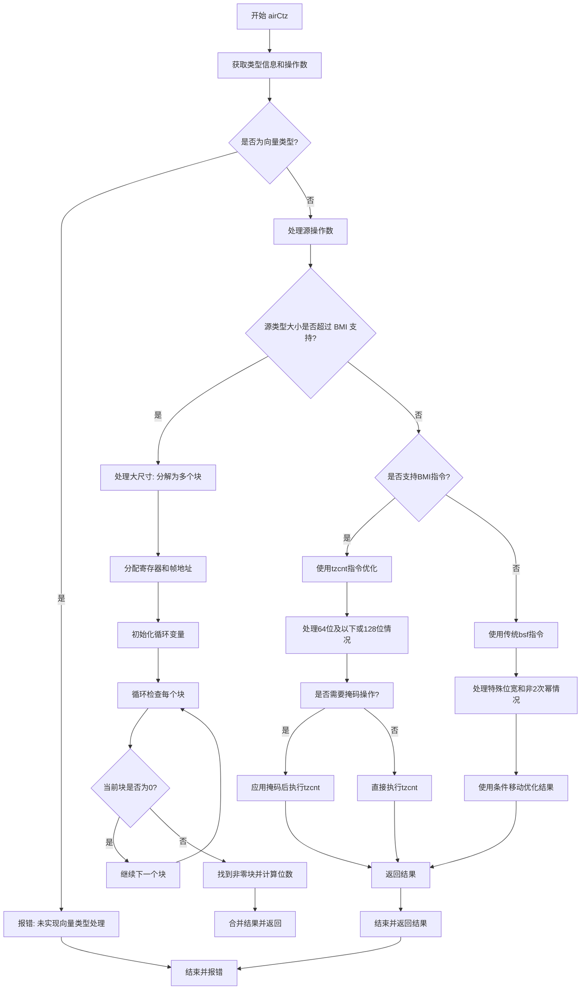

好的，我需要为提供的Zig函数`airCtz`绘制流程图。首先，我需要理解这个函数的功能和结构。这个函数似乎是处理计算尾随零位（count trailing zeros）的代码生成部分，属于编译器后端的一部分，针对x86_64架构。

首先，我会通读代码，了解主要的分支和逻辑。函数开始于一些初始化步骤，获取类型信息，处理向量类型（TODO，暂时不支持）。然后根据源类型的大小和是否支持BMI指令集，分为不同的处理路径。

主要的分支包括：
1. 处理大于64位或128位的情况（取决于是否有BMI），需要分解为多个limb（块）处理，使用循环逐个检查每个块。
2. 使用BMI指令的tzcnt来优化处理64位及以下的情况。
3. 对于不支持BMI的情况，使用传统的位扫描（bsf）指令，并结合条件移动（cmov）来处理特殊情况。

接下来，我需要将这些逻辑步骤转化为流程图的结构。每个条件判断（如是否有BMI，源类型的大小等）会成为流程图的决策节点。每个处理路径会成为不同的分支，最终汇总到返回结果。

需要注意循环结构的存在，比如在处理大尺寸时使用的循环检查每个块是否为0。此外，各种寄存器分配和释放操作也需要在流程中体现，但由于流程图主要关注控制流，可能不需要详细描述每个寄存器的操作，除非对理解流程至关重要。

可能遇到的挑战是如何清晰地表示嵌套的条件和循环，同时保持流程图的可读性。需要合理使用子流程或分组来组织复杂的部分。此外，确保所有可能的路径都被覆盖，避免遗漏任何分支。

最后，根据上述分析，使用Mermaid语法绘制流程图，确保节点和箭头的正确连接，正确使用条件判断符号，并合理排列结构，使流程图易于理解。
================================================
