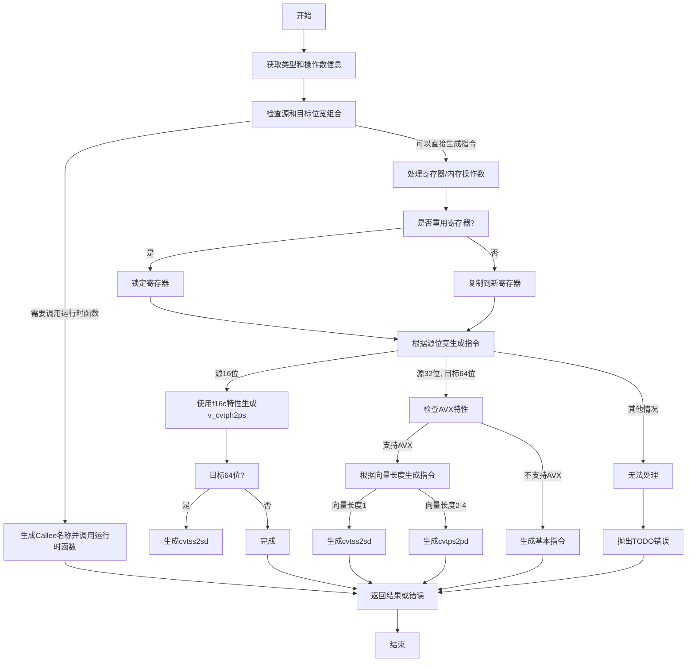

好的，我现在要画这个函数的流程图。首先，我需要理解这个函数的结构和逻辑。这个函数是airFpext，看起来是处理浮点扩展的代码生成部分。

首先，函数开始获取一些类型和操作数信息，比如目标类型dst_ty，源类型src_ty，以及它们的位宽。然后有一个大的结果块result，里面有很多条件判断。

我看到有很多switch语句，根据源位宽和目标位宽的不同情况来处理不同的转换。例如，当源是16位时，检查目标是否是32或64位，并且是否支持f16c特性。如果不满足条件，可能需要调用编译器运行时函数，生成对应的callee名称，比如__extendhfdf2之类的。这部分可能需要生成函数调用，否则继续处理。

接下来是处理寄存器分配和复制操作，将源操作数复制到目标寄存器。然后根据不同的位宽和向量长度，生成不同的汇编指令，比如v_cvtph2ps、cvtss2sd等。如果某些情况无法处理，就返回null，触发TODO错误。

需要注意到有很多条件分支，比如检查是否是向量类型、是否有特定的CPU特性（如f16c、avx等），以及操作数的类型（寄存器还是内存地址）。每个分支对应不同的汇编指令生成路径。

流程图的开始应该是函数入口，然后是获取各种类型和操作数信息。接下来判断是否满足直接生成汇编指令的条件，如果满足，则处理寄存器复制和生成相应的汇编指令；如果不满足，则生成运行时函数调用。如果无法处理的情况，抛出错误。

可能的分支包括：

1. 判断源位宽和目标位宽的组合，决定是否需要调用编译器运行时函数。
2. 处理向量类型和非向量类型的情况。
3. 根据不同的CPU特性选择不同的指令。
4. 处理源操作数是寄存器还是内存地址，生成不同的汇编指令。

最后，如果所有情况都处理完毕，返回结果，否则返回错误信息。

需要注意的是，代码中有多个break :result和条件判断，需要正确映射到流程图的各个判断节点。同时，错误处理部分也要在流程图中体现，比如当无法处理时触发fail。
================================================
