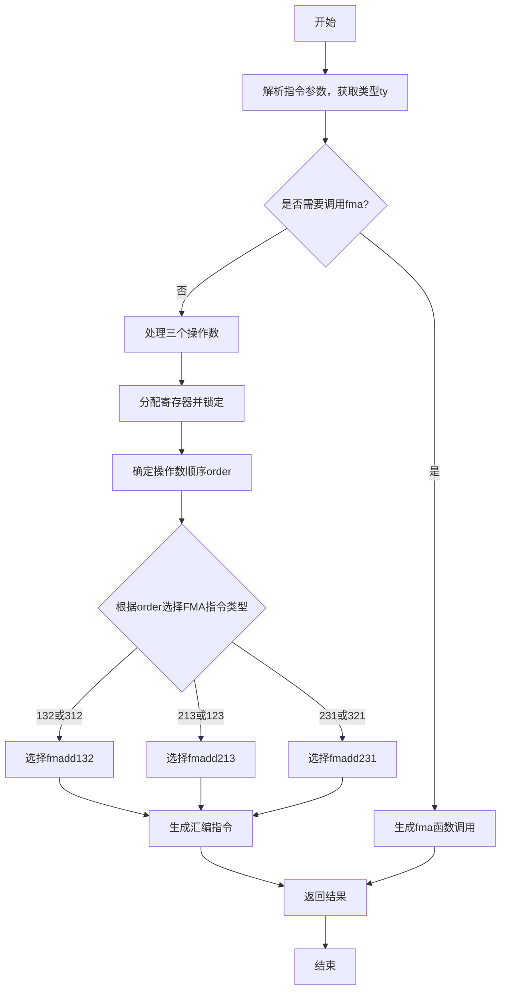

好的，我现在需要帮用户画一个函数的流程图，使用mermaid。用户提供的函数是Zig语言写的，函数名为airMulAdd，属于代码生成的一部分，特别是针对x86_64架构的。首先，我需要理解这个函数的结构和逻辑，然后将其转化为流程图。

首先，我应该通读一遍代码，了解大致流程。函数开始处声明了一些变量，比如pt、zcu、pl_op、extra、ty等。然后根据类型ty的不同情况，进入不同的处理分支。特别是有一个条件判断，检查目标平台是否支持FMA（乘加融合指令），如果不支持，则生成调用fma函数的代码；如果支持，则尝试生成相应的FMA指令。

接下来，函数处理了三个操作数ops，可能是乘法加法的三个参数。然后通过一些逻辑确定寄存器的分配和顺序，包括复制到临时寄存器、锁定寄存器等。之后，根据操作数的顺序（order数组）选择不同的Mir指令标签（mir_tag），最后生成相应的汇编指令，并将结果返回。

现在需要将这个过程分解成流程图中的各个步骤。通常，流程图包括开始、判断、处理步骤、结束等节点。需要确定主要的判断点和分支。

流程大致如下：
1. 开始。
2. 解析指令参数，获取类型信息。
3. 判断是否需要调用库函数fma：
   - 如果类型是16、80、128位浮点，或者32、64位但目标不支持FMA，则调用fma。
   - 否则，进入生成FMA指令的逻辑。
4. 如果调用fma，生成对应的函数调用。
5. 否则，处理三个操作数，分配寄存器，确定操作顺序。
6. 根据操作数的顺序选择对应的FMA指令类型（如fmadd132、fmadd213等）。
7. 生成汇编指令。
8. 结束，返回结果。

需要注意条件分支的嵌套结构，例如在判断类型是否支持FMA后，还有不同的情况处理。此外，在处理操作数时，有多个循环和条件判断，比如处理每个操作数的寄存器分配、确定顺序等。

在转换为流程图时，可能需要简化一些细节，比如循环处理操作数的部分可以概括为一个处理步骤，而不需要展开每个循环迭代。同样，错误处理和资源释放（如解锁寄存器）也需要在流程图中体现，可能作为步骤的一部分或单独的节点。

另外，函数最后返回结果，这应该作为流程图的结束点。

现在需要考虑如何用mermaid的语法结构来表示这些步骤。开始和结束用圆角矩形，判断用菱形，处理步骤用矩形，箭头表示流程方向。

可能的节点包括：
- 开始
- 获取类型信息
- 检查是否需要调用fma
  - 是：生成fma调用
  - 否：处理操作数和寄存器
    - 处理每个操作数，分配寄存器
    - 确定操作顺序
    - 选择对应的FMA指令类型
    - 生成汇编指令
- 返回结果

需要确保每个分支都正确连接，特别是条件判断后的不同路径。同时，错误处理（如fail）可能作为另一个分支，但用户提供的代码中可能没有详细展示，所以可能暂时忽略错误处理分支，专注于主流程。

总结后，流程图的结构大致如下：

开始 -> 解析参数和类型
-> 判断是否调用fma
   -> 是：生成fma调用 -> 结束
   -> 否：处理操作数 -> 分配寄存器 -> 确定顺序 -> 选择FMA类型 -> 生成汇编 -> 结束

需要将这些步骤用mermaid语法表示出来，注意条件分支的正确连接。
================================================
