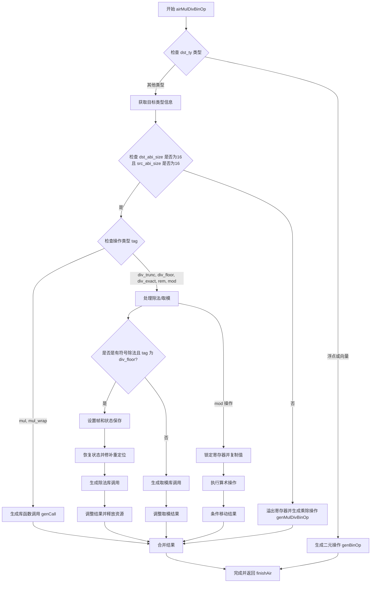

嗯，我现在需要画一个关于这个Zig函数的流程图。首先，我需要理解这个函数的结构和逻辑。这个函数名为airMulDivBinOp，处理乘法和除法相关的二元操作。看起来它首先根据目标类型（dst_ty）进行不同的处理，如果是浮点或向量类型，就直接生成二元操作。否则，处理整数类型的乘除运算。

接下来，函数处理不同的tag，比如.mul, .div_trunc等。对于某些情况，比如16字节的ABI大小，可能需要调用特定的库函数，比如__udivti3或者类似的。在处理有符号除法和取模时，还有一些额外的步骤，比如保存状态、恢复状态、处理寄存器等。

我需要将这些逻辑步骤分解成流程图中的各个节点。可能的分支点包括：目标类型是否为浮点/向量，ABI大小是否为16，不同的操作tag，以及是否有符号处理等。每个分支下有不同的处理步骤，比如生成调用、处理寄存器、保存状态等。

还要注意错误处理和资源管理，比如锁存寄存器后需要解锁，这可能对应流程中的释放资源步骤。此外，函数末尾返回结果，并调用finishAir。

现在，我需要将这些步骤组织成一个流程图，使用mermaid的语法。每个判断条件作为菱形节点，处理步骤作为矩形节点，箭头表示流程方向。可能需要多个分支来处理不同的tag和条件。

需要注意的是，代码中有一些复杂的逻辑，比如处理signed_div_floor_state的情况，以及mod操作时的寄存器操作。这些部分需要详细分解，确保流程图的准确性。

可能遇到的困难是代码中一些复杂的条件判断和嵌套处理，需要仔细阅读代码以确保每个分支都被正确表示。此外，函数中调用的其他方法（如genCall, spillRegisters等）可能在流程图中简化为一个步骤，除非需要详细展开。

最终，流程图应该从函数入口开始，逐步经过各个条件判断，处理不同的情况，直到生成结果并返回。确保所有主要路径都被覆盖，包括错误处理和资源释放。
================================================

流程说明：
1. 函数入口首先检查目标类型是否为浮点/向量类型，如果是则直接生成二元操作
2. 对于整型操作：
   - 处理 128 位整数类型（dst_abi_size=16）的特殊情况
   - 根据操作类型（div/mod）选择不同的处理路径
   - 对有符号除法地板除（div_floor）进行复杂的状态保存/恢复和结果调整
   - 对取模操作进行额外的寄存器操作和条件移动
3. 普通整型操作通过溢出寄存器后调用通用生成函数
4. 最终所有路径汇聚到结果合并和收尾处理
5. 错误处理路径通过 Zig 的错误联合类型隐式处理（未显式展示）